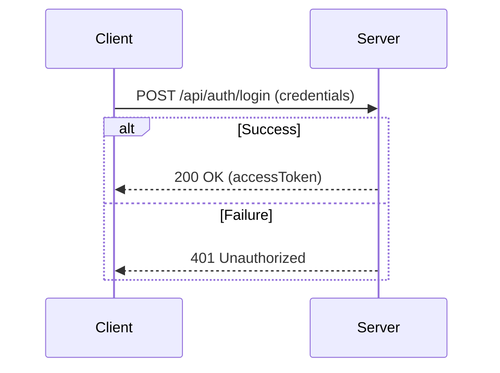
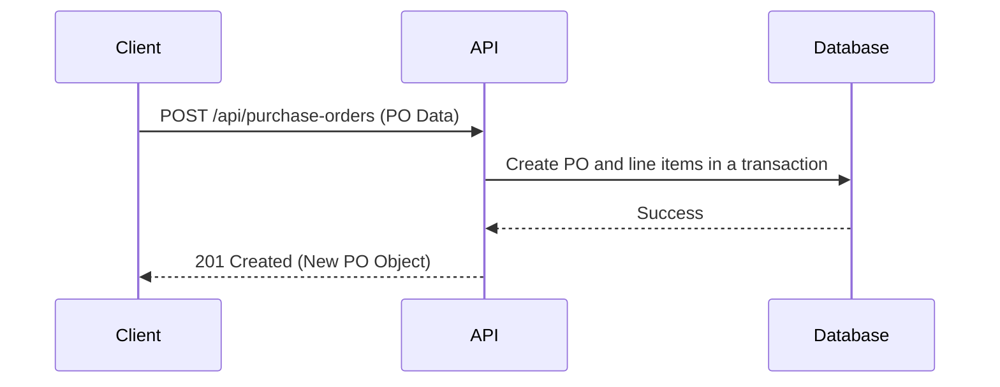

# API Reference

A comprehensive guide to all REST API endpoints in the Supplier & Vendor Management System.

## Authentication

All protected routes require a Bearer Token in the `Authorization` header. Get a token by logging in.

**Endpoint:** `POST /api/auth/login`

**Request Body:**
```json
{
  "username": "string",
  "password": "string"
}
```

**Response (Success - 200 OK):**
```json
{
  "access_token": "eyJhbGciOiJIUzI1NiIsInR5cCI6IkpXVCJ9..."
}
```

**Response (Failure - 401 Unauthorized):**
```json
{
  "statusCode": 401,
  "message": "Invalid credentials"
}
```

**Auth Flow**


## Users

**Base Path:** `/api/users`

| Method | Path | Description |
|---|---|---|
| `GET` | `/` | Get all users |
| `GET` | `/{id}` | Get a specific user |
| `POST` | `/` | Create a new user |
| `PUT` | `/{id}` | Update a user |
| `DELETE` | `/{id}` | Delete a user |
| `GET` | `/roles` | Get all roles |

**Create User (POST /api/users)**
**Request Body:**
```json
{
  "username": "string",
  "email": "string",
  "password": "string",
  "roleId": "number"
}
```

**Response (201 Created):**
```json
{
  "id": 1,
  "username": "string",
  "email": "string",
  "roleId": 1,
  "createdAt": "2023-01-01T00:00:00.000Z",
  "updatedAt": "2023-01-01T00:00:00.000Z"
}
```

## Suppliers

**Base Path:** `/api/suppliers`

| Method | Path | Description |
|---|---|---|
| `GET` | `/` | Get all suppliers |
| `GET` | `/{id}` | Get a specific supplier |
| `POST` | `/` | Create a new supplier |
| `PUT` | `/{id}` | Update a supplier |
| `DELETE` | `/{id}` | Delete a supplier |

**Create Supplier (POST /api/suppliers)**
**Request Body:**
```json
{
  "name": "string",
  "contactPerson": "string (optional)",
  "email": "string",
  "phone": "string (optional)",
  "address": "string (optional)",
  "rating": "number (optional)"
}
```

**Response (201 Created):**
```json
{
  "id": 1,
  "name": "string",
  "contactPerson": "string",
  "email": "string",
  "phone": "string",
  "address": "string",
  "rating": 5,
  "createdAt": "2023-01-01T00:00:00.000Z",
  "updatedAt": "2023-01-01T00:00:00.000Z"
}
```

## Products

**Base Path:** `/api/products`

| Method | Path | Description |
|---|---|---|
| `GET` | `/` | Get all products |
| `POST` | `/` | Create a new product |
| `GET` | `/categories` | Get all categories |
| `POST` | `/categories` | Create a new category |

**Create Product (POST /api/products)**
**Request Body:**
```json
{
  "name": "string",
  "description": "string (optional)",
  "price": "number"
}
```

**Response (201 Created):**
```json
{
  "id": 1,
  "name": "string",
  "description": "string",
  "price": 99.99
}
```

**Create Category (POST /api/products/categories)**
**Request Body:**
```json
{
  "name": "string"
}
```

**Response (201 Created):**
```json
{
  "id": 1,
  "name": "string"
}
```

## Purchase Orders

**Base Path:** `/api/purchase-orders`

| Method | Path | Description |
|---|---|---|
| `GET` | `/` | Get all purchase orders |
| `GET` | `/{id}` | Get a specific purchase order |
| `POST` | `/` | Create a new purchase order |
| `PUT` | `/{id}/status` | Update purchase order status |

**Create Purchase Order (POST /api/purchase-orders)**
**Request Body:**
```json
{
  "supplierId": "number",
  "createdById": "number",
  "orderDate": "date",
  "items": [
    {
      "productId": "number",
      "quantity": "number",
      "unitPrice": "number"
    }
  ]
}
```

**Response (201 Created):**
```json
{
  "id": 1,
  "supplierId": 1,
  "createdById": 1,
  "orderDate": "2023-01-01T00:00:00.000Z",
  "status": "Pending",
  "createdAt": "2023-01-01T00:00:00.000Z"
}
```

**PO Creation Sequence**


## Invoices

**Base Path:** `/api/invoices`

| Method | Path | Description |
|---|---|---|
| `GET` | `/` | Get all invoices |
| `GET` | `/{id}` | Get a specific invoice |
| `POST` | `/` | Create a new invoice |
| `PUT` | `/{id}/status` | Update invoice status |

**Create Invoice (POST /api/invoices)**
**Request Body:**
```json
{
  "purchaseOrderId": "number",
  "invoiceDate": "date",
  "dueDate": "date",
  "status": "string"
}
```

**Response (201 Created):**
```json
{
  "id": 1,
  "purchaseOrderId": 1,
  "invoiceDate": "2023-01-01T00:00:00.000Z",
  "dueDate": "2023-01-15T00:00:00.000Z",
  "status": "Pending"
}
```

## Payments

**Base Path:** `/api/payments`

| Method | Path | Description |
|---|---|---|
| `GET` | `/` | Get all payments |
| `GET` | `/{id}` | Get a specific payment |
| `GET` | `/invoice/{invoiceId}` | Get payments for an invoice |
| `POST` | `/` | Create a new payment |

**Create Payment (POST /api/payments)**
**Request Body:**
```json
{
  "invoiceId": "number",
  "paymentDate": "date",
  "amount": "number"
}
```

**Response (201 Created):**
```json
{
  "id": 1,
  "invoiceId": 1,
  "paymentDate": "2023-01-01T00:00:00.000Z",
  "amount": 99.99
}
```