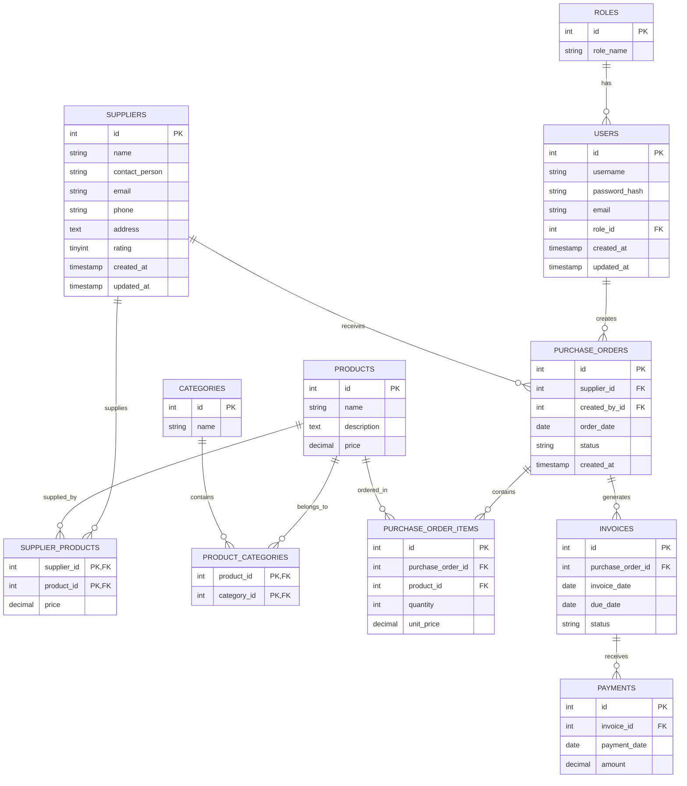

# Database Schema

This document provides a comprehensive overview of all tables in the database and their relationships.

## Entity Relationship Diagram

## Table Details

### `roles`
| Column | Type | Constraints |
|---|---|---|
| `id` | INT | PK, AUTO_INCREMENT |
| `role_name` | VARCHAR(50) | NOT NULL, UNIQUE |

### `users`
| Column | Type | Constraints |
|---|---|---|
| `id` | INT | PK, AUTO_INCREMENT |
| `username` | VARCHAR(255) | NOT NULL, UNIQUE |
| `password_hash` | VARCHAR(255) | NOT NULL |
| `email` | VARCHAR(255) | NOT NULL, UNIQUE |
| `role_id` | INT | FK to `roles.id` |
| `created_at` | TIMESTAMP | DEFAULT CURRENT_TIMESTAMP |
| `updated_at` | TIMESTAMP | DEFAULT CURRENT_TIMESTAMP ON UPDATE CURRENT_TIMESTAMP |

### `suppliers`
| Column | Type | Constraints |
|---|---|---|
| `id` | INT | PK, AUTO_INCREMENT |
| `name` | VARCHAR(255) | NOT NULL |
| `contact_person` | VARCHAR(255) | |
| `email` | VARCHAR(255) | NOT NULL, UNIQUE |
| `phone` | VARCHAR(50) | |
| `address` | TEXT | |
| `rating` | TINYINT | |
| `created_at` | TIMESTAMP | DEFAULT CURRENT_TIMESTAMP |
| `updated_at` | TIMESTAMP | DEFAULT CURRENT_TIMESTAMP ON UPDATE CURRENT_TIMESTAMP |

### `products`
| Column | Type | Constraints |
|---|---|---|
| `id` | INT | PK, AUTO_INCREMENT |
| `name` | VARCHAR(255) | NOT NULL |
| `description` | TEXT | |
| `price` | DECIMAL(10, 2) | NOT NULL |

### `categories`
| Column | Type | Constraints |
|---|---|---|
| `id` | INT | PK, AUTO_INCREMENT |
| `name` | VARCHAR(255) | NOT NULL |

### `product_categories` (Junction table)
| Column | Type | Constraints |
|---|---|---|
| `product_id` | INT | PK, FK to `products.id` |
| `category_id` | INT | PK, FK to `categories.id` |

### `supplier_products` (Junction table)
| Column | Type | Constraints |
|---|---|---|
| `supplier_id` | INT | PK, FK to `suppliers.id` |
| `product_id` | INT | PK, FK to `products.id` |
| `price` | DECIMAL(10, 2) | NOT NULL |

### `purchase_orders`
| Column | Type | Constraints |
|---|---|---|
| `id` | INT | PK, AUTO_INCREMENT |
| `supplier_id` | INT | FK to `suppliers.id` |
| `created_by_id` | INT | FK to `users.id` |
| `order_date` | DATE | NOT NULL |
| `status` | VARCHAR(50) | NOT NULL |
| `created_at` | TIMESTAMP | DEFAULT CURRENT_TIMESTAMP |

### `purchase_order_items`
| Column | Type | Constraints |
|---|---|---|
| `id` | INT | PK, AUTO_INCREMENT |
| `purchase_order_id` | INT | FK to `purchase_orders.id` |
| `product_id` | INT | FK to `products.id` |
| `quantity` | INT | NOT NULL |
| `unit_price` | DECIMAL(10, 2) | NOT NULL |

### `invoices`
| Column | Type | Constraints |
|---|---|---|
| `id` | INT | PK, AUTO_INCREMENT |
| `purchase_order_id` | INT | FK to `purchase_orders.id` |
| `invoice_date` | DATE | NOT NULL |
| `due_date` | DATE | NOT NULL |
| `status` | VARCHAR(50) | NOT NULL |

### `payments`
| Column | Type | Constraints |
|---|---|---|
| `id` | INT | PK, AUTO_INCREMENT |
| `invoice_id` | INT | FK to `invoices.id` |
| `payment_date` | DATE | NOT NULL |
| `amount` | DECIMAL(10, 2) | NOT NULL |
