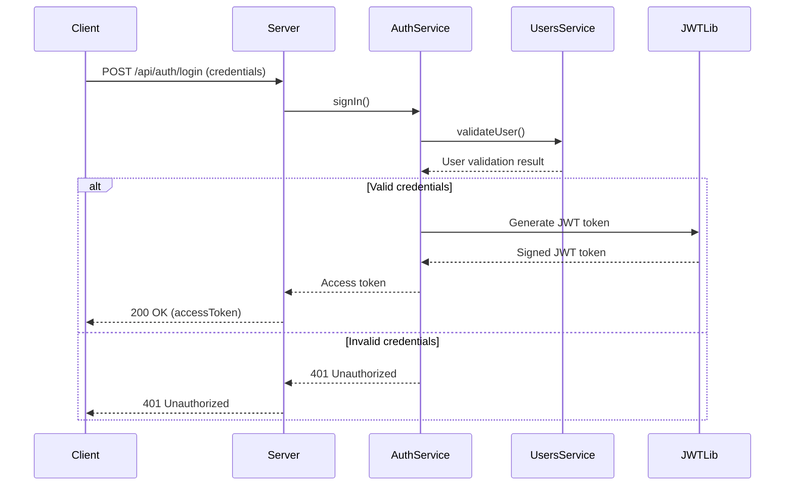

```mermaid
sequenceDiagram
    participant Client
    participant Server
    participant AuthService
    participant UsersService
    participant JWTLib
    Client->>Server: POST /api/auth/login (credentials)
    Server->>AuthService: signIn()
    AuthService->>UsersService: validateUser()
    UsersService-->>AuthService: User validation result
    alt Valid credentials
        AuthService->>JWTLib: Generate JWT token
        JWTLib-->>AuthService: Signed JWT token
        AuthService-->>Server: Access token
        Server-->>Client: 200 OK (accessToken)
    else Invalid credentials
        AuthService-->>Server: 401 Unauthorized
        Server-->>Client: 401 Unauthorized
    end
```