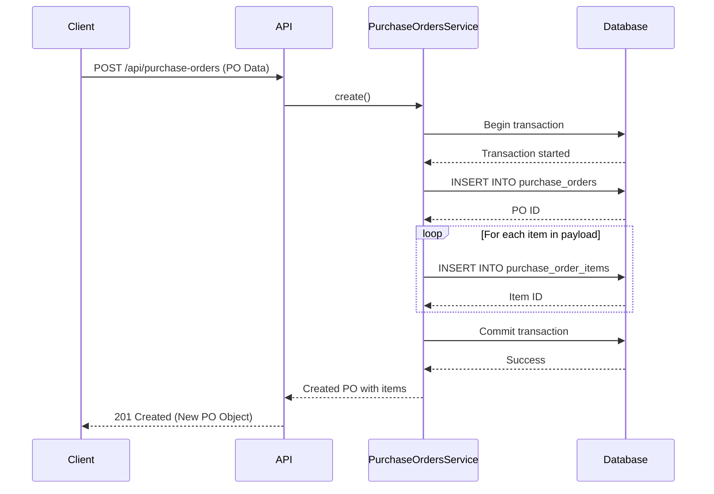

```mermaid
sequenceDiagram
    participant Client
    participant API
    participant PurchaseOrdersService
    participant Database
    Client->>API: POST /api/purchase-orders (PO Data)
    API->>PurchaseOrdersService: create()
    PurchaseOrdersService->>Database: Begin transaction
    Database-->>PurchaseOrdersService: Transaction started
    PurchaseOrdersService->>Database: INSERT INTO purchase_orders
    Database-->>PurchaseOrdersService: PO ID
    loop For each item in payload
        PurchaseOrdersService->>Database: INSERT INTO purchase_order_items
        Database-->>PurchaseOrdersService: Item ID
    end
    PurchaseOrdersService->>Database: Commit transaction
    Database-->>PurchaseOrdersService: Success
    PurchaseOrdersService-->>API: Created PO with items
    API-->>Client: 201 Created (New PO Object)
```