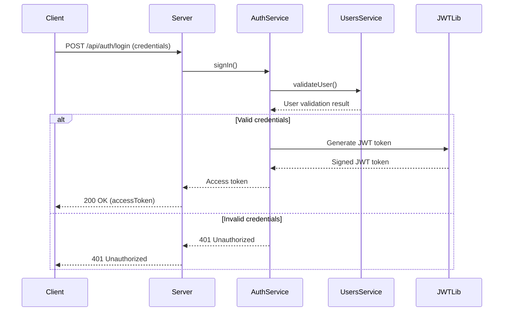
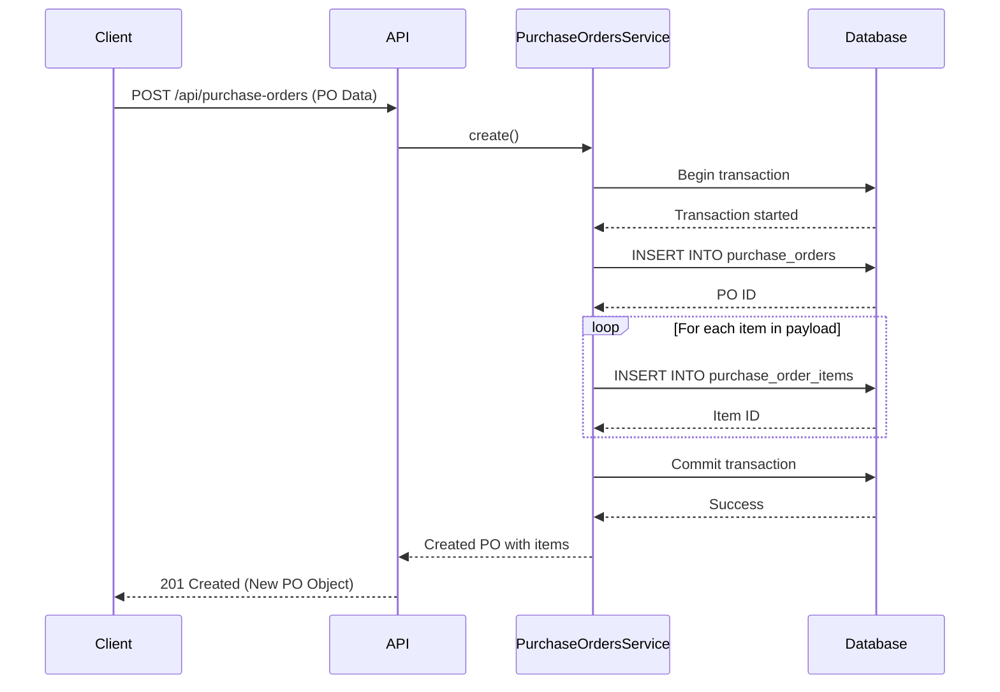

# API Reference

A comprehensive guide to all REST API endpoints in the Supplier & Vendor Management System built with NestJS. All API endpoints are prefixed with `/api/` as configured in the main application setup. The system implements JWT-based authentication for protected routes with validation performed by the AuthMiddleware that checks for Bearer tokens in the Authorization header.

## Authentication

All protected routes require a Bearer Token in the `Authorization` header. Get a token by logging in via the authentication endpoint. The authentication system uses JWT tokens with a default 1-hour expiration, bcrypt for password hashing, and validation through the SignInDto class to ensure secure login credentials.

**Endpoint:** `POST /api/auth/login`

**Request Body:**
```json
{
  "username": "string (required, min length 1)",
  "password": "string (required, min length 1)"
}
```

**Response (Success - 200 OK):**
```json
{
  "access_token": "eyJhbGciOiJIUzI1NiIsInR5cCI6IkpXVCJ9..."
}
```

**Response (Failure - 401 Unauthorized):**
```json
{
  "statusCode": 401,
  "message": "Invalid credentials"
}
```

**Auth Flow**


## Users

**Base Path:** `/api/users`

The Users module provides endpoints for managing user accounts with password hashing using bcrypt and role-based access. All user operations are validated using createUserDto and updateUserDto classes with appropriate class-validator annotations for data integrity. The module implements proper relationships with roles and purchase orders through TypeORM entities. The endpoints return user information while ensuring sensitive data like password hashes are never exposed in responses.

| Method | Path | Description |
|---|---|---|
| `GET` | `/` | Get all users with details (username, email, role, timestamps) |
| `GET` | `/{id}` | Get a specific user by ID |
| `POST` | `/` | Create a new user (password will be hashed) |
| `PUT` | `/{id}` | Update a user's information |
| `GET` | `/roles` | Get all available roles |

**Create User (POST /api/users)**
**Request Body:**
```json
{
  "username": "string (required)",
  "email": "string (required, valid email)",
  "password": "string (required)",
  "roleId": "number (required, foreign key to roles table)"
}
```

**Response (201 Created):**
```json
{
  "id": 1,
  "username": "string",
  "email": "string",
  "roleId": 1,
  "createdAt": "2023-01-01T00:00:00.000Z",
  "updatedAt": "2023-01-01T00:00:00.000Z"
}
```

## Suppliers

**Base Path:** `/api/suppliers`

The Suppliers module provides endpoints for managing supplier information including contact details, ratings, and related entities. All supplier operations use CreateSupplierDto and UpdateSupplierDto with class-validator for input validation. The module maintains relationships with purchase orders and supplier products through TypeORM entities, enforcing unique email constraints to prevent duplicate suppliers. The system allows multiple suppliers to offer the same product at different prices through the supplier_products junction table. All supplier endpoints return complete supplier information while maintaining data integrity through validation layers in the service layer. Pagination and search capabilities can be implemented in the service layer as needed for larger datasets.


| Method | Path | Description |
|---|---|---|
| `GET` | `/` | Get all suppliers with details |
| `GET` | `/{id}` | Get a specific supplier by ID |
| `POST` | `/` | Create a new supplier |
| `PUT` | `/{id}` | Update an existing supplier |
| `DELETE` | `/{id}` | Remove a supplier (not implemented in the controller) |

**Create Supplier (POST /api/suppliers)**
**Request Body:**
```json
{
  "name": "string (required)",
  "contactPerson": "string (optional)",
  "email": "string (required, valid email)",
  "phone": "string (optional)",
  "address": "string (optional)",
  "rating": "number (optional, 0-5 scale)"
}
```

**Response (201 Created):**
```json
{
  "id": 1,
  "name": "string",
  "contactPerson": "string",
  "email": "string",
  "phone": "string",
  "address": "string",
  "rating": 5,
  "createdAt": "2023-01-01T00:00:00.000Z",
  "updatedAt": "2023-01-01T00:00:00.000Z"
}
```

## Products

**Base Path:** `/api/products`

The Products module manages product catalog information including names, descriptions, prices, and category associations. The module implements a separate endpoint for managing categories with CreateCategoryDto validation. Products can belong to multiple categories through the product_categories junction table. The system supports multiple suppliers offering the same product through the supplier_products relationship. All product operations use validation DTOs (CreateProductDto, UpdateProductDto) to ensure data integrity and prevent invalid entries. The service layer includes proper exception handling using NotFoundException and implements repository patterns through TypeORM for database operations. Product images or additional metadata fields can be added as extensions to the product entity as needed. The system maintains referential integrity with purchase order items, ensuring products can't be deleted if referenced in active purchase orders.


| Method | Path | Description |
|---|---|---|
| `GET` | `/` | Get all products with details |
| `POST` | `/` | Create a new product |
| `PUT` | `/{id}` | Update an existing product |
| `DELETE` | `/{id}` | Delete a product (only if not referenced elsewhere) |
| `GET` | `/categories` | Get all product categories |
| `POST` | `/categories` | Create a new product category |
| `GET` | `/categories/{id}` | Get a specific category by ID |

**Create Product (POST /api/products)**
**Request Body:**
```json
{
  "name": "string (required)",
  "description": "string (optional)",
  "price": "number (required, positive decimal)"
}
```

**Response (201 Created):**
```json
{
  "id": 1,
  "name": "string",
  "description": "string",
  "price": 99.99
}
```

**Create Category (POST /api/products/categories)**
**Request Body:**
```json
{
  "name": "string (required)"
}
```

**Response (201 Created):**
```json
{
  "id": 1,
  "name": "string"
}
```

## Purchase Orders

**Base Path:** `/api/purchase-orders`

The Purchase Orders module handles the creation and management of purchase orders with multiple line items and status tracking. Each purchase order has a relationship with a supplier and the user who created it, with status tracking through the system lifecycle (Pending, Approved, Shipped, Completed, Cancelled). The module uses CreatePurchaseOrderDto with nested validation for purchase order items, ensuring data integrity at all levels. Purchase orders include order date and creation timestamp, and they maintain relationships with invoices once they are invoiced. The module implements proper transaction handling through TypeORM to ensure that when purchase orders with multiple items are created, either all items are saved successfully or the entire operation is rolled back. The service layer includes validation to ensure that referenced products and suppliers exist before creating purchase orders. Purchase order status updates are handled separately through the status update endpoint to maintain clean separation of concerns. The system prevents modification of purchase orders through direct PUT requests, requiring status updates through the dedicated endpoint.


| Method | Path | Description |
|---|---|---|
| `GET` | `/` | Get all purchase orders with supplier and creator info |
| `GET` | `/{id}` | Get a specific purchase order by ID |
| `POST` | `/` | Create a new purchase order with items |
| `PUT` | `/{id}/status` | Update purchase order status |

**Create Purchase Order (POST /api/purchase-orders)**
**Request Body:**
```json
{
  "supplierId": "number (required, foreign key to suppliers)",
  "createdById": "number (required, foreign key to users)",
  "orderDate": "date (required)",
  "items": [
    {
      "productId": "number (required, foreign key to products)",
      "quantity": "number (required, positive integer)",
      "unitPrice": "number (required, positive decimal)"
    }
  ]
}
```

**Response (201 Created):**
```json
{
  "id": 1,
  "supplierId": 1,
  "createdById": 1,
  "orderDate": "2023-01-01T00:00:00.000Z",
  "status": "Pending",
  "createdAt": "2023-01-01T00:00:00.000Z",
  "purchaseOrderItems": [
    {
      "id": 1,
      "productId": 1,
      "quantity": 10,
      "unitPrice": 99.99
    }
  ]
}
```

**PO Creation Sequence**


## Invoices

**Base Path:** `/api/invoices`

The Invoices module manages invoicing for purchase orders, linking invoices to specific purchase orders with invoice dates, due dates, and status tracking. The system supports invoice status updates (Pending, Paid, Overdue, Cancelled) through the dedicated status endpoint. All invoices are validated against existing purchase orders to ensure referential integrity. The module includes relations to purchase orders and associated items, enabling comprehensive invoice display with all ordered products. The service layer implements proper validation to ensure invoices can only be created for valid purchase orders and that all required fields are provided. Invoice creation follows business logic where invoices are typically created after purchase orders are approved or shipped. The system maintains referential integrity with payments, tracking which payments apply to which invoices. Invoice endpoints return complete invoice information including related purchase order and items information through TypeORM relations. The status endpoint allows for updating invoice status independently of other operations.


| Method | Path | Description |
|---|---|---|
| `GET` | `/` | Get all invoices with related purchase order info |
| `GET` | `/{id}` | Get a specific invoice by ID |
| `POST` | `/` | Create a new invoice linked to a purchase order |
| `PUT` | `/{id}/status` | Update invoice status |

**Create Invoice (POST /api/invoices)**
**Request Body:**
```json
{
  "purchaseOrderId": "number (required, foreign key to purchase_orders)",
  "invoiceDate": "date (required)",
  "dueDate": "date (required)",
  "status": "string (required, default 'Pending')"
}
```

**Response (201 Created):**
```json
{
  "id": 1,
  "purchaseOrderId": 1,
  "invoiceDate": "2023-01-01T00:00:00.000Z",
  "dueDate": "2023-01-15T00:00:00.000Z",
  "status": "Pending",
  "purchaseOrder": {
    "id": 1,
    "supplierId": 1,
    "createdById": 1,
    "orderDate": "2023-01-01T00:00:00.000Z",
    "status": "Approved",
    "purchaseOrderItems": [
      {
        "id": 1,
        "productId": 1,
        "quantity": 10,
        "unitPrice": 99.99,
        "product": {
          "id": 1,
          "name": "Product Name",
          "description": "Product description",
          "price": 99.99
        }
      }
    ]
  }
}
```

## Payments

**Base Path:** `/api/payments`

The Payments module tracks payment records against invoices, with each payment having an amount, date, and reference to an invoice. The system supports multiple payments per invoice, allowing for partial payments when needed. All payment operations include validation to ensure payment amounts are positive and properly linked to valid invoices. The module implements proper decimal precision handling for monetary values using TypeORM's decimal type with 10,2 precision. Payment endpoints include functionality to retrieve all payments for a specific invoice, enabling comprehensive payment history tracking. The service layer includes validation to ensure payments don't exceed the invoice amount without appropriate business logic. Payments are related to invoices through TypeORM relationships, allowing for complete payment history display. The system maintains audit trails through creation timestamps and ensures referential integrity with invoices. The payment module works in conjunction with the invoice module to update invoice status based on payment status when appropriate.


| Method | Path | Description |
|---|---|---|
| `GET` | `/` | Get all payments with related invoice info |
| `GET` | `/{id}` | Get a specific payment by ID |
| `GET` | `/invoice/{invoiceId}` | Get all payments for a specific invoice |
| `POST` | `/` | Create a new payment for an invoice |

**Create Payment (POST /api/payments)**
**Request Body:**
```json
{
  "invoiceId": "number (required, foreign key to invoices)",
  "paymentDate": "date (required)",
  "amount": "number (required, positive decimal)"
}
```

**Response (201 Created):**
```json
{
  "id": 1,
  "invoiceId": 1,
  "paymentDate": "2023-01-01T00:00:00.000Z",
  "amount": 99.99,
  "invoice": {
    "id": 1,
    "purchaseOrderId": 1,
    "invoiceDate": "2023-01-01T00:00:00.000Z",
    "dueDate": "2023-01-15T00:00:00.000Z",
    "status": "Paid"
  }
}
```