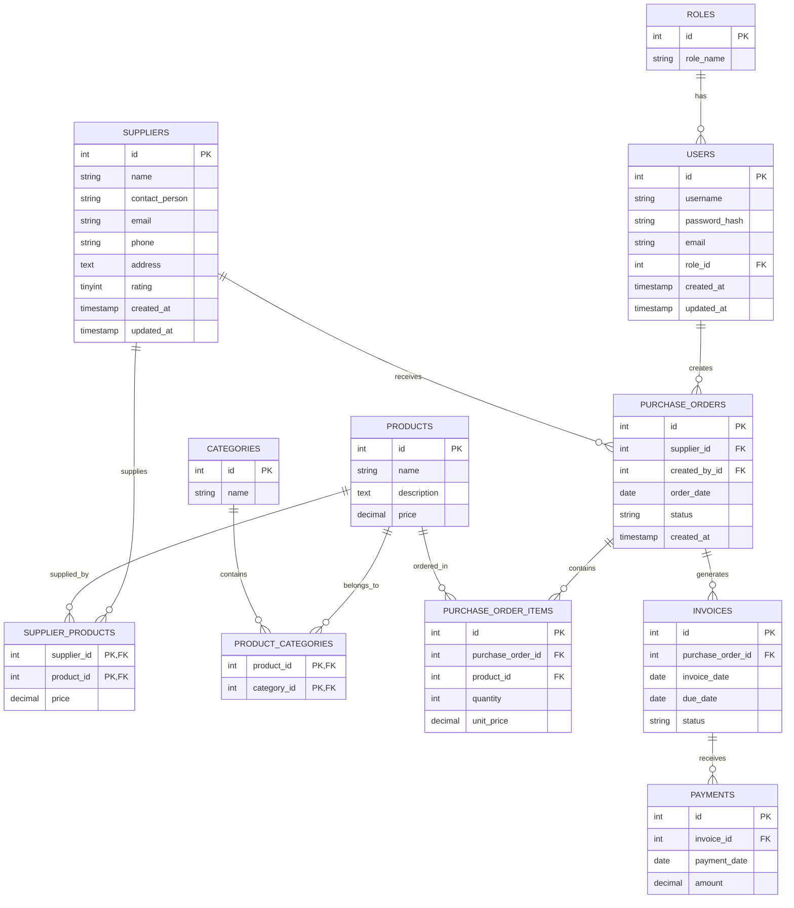

```mermaid
erDiagram
    ROLES ||--o{ USERS : "has"
    USERS ||--o{ PURCHASE_ORDERS : "creates"
    SUPPLIERS ||--o{ PURCHASE_ORDERS : "receives"
    SUPPLIERS ||--o{ SUPPLIER_PRODUCTS : "supplies"
    PRODUCTS ||--o{ SUPPLIER_PRODUCTS : "supplied_by"
    PRODUCTS ||--o{ PRODUCT_CATEGORIES : "belongs_to"
    CATEGORIES ||--o{ PRODUCT_CATEGORIES : "contains"
    PURCHASE_ORDERS ||--o{ PURCHASE_ORDER_ITEMS : "contains"
    PRODUCTS ||--o{ PURCHASE_ORDER_ITEMS : "ordered_in"
    PURCHASE_ORDERS ||--o{ INVOICES : "generates"
    INVOICES ||--o{ PAYMENTS : "receives"
    
    ROLES {
        int id PK
        string role_name
    }
    
    USERS {
        int id PK
        string username
        string password_hash
        string email
        int role_id FK
        timestamp created_at
        timestamp updated_at
    }
    
    SUPPLIERS {
        int id PK
        string name
        string contact_person
        string email
        string phone
        text address
        tinyint rating
        timestamp created_at
        timestamp updated_at
    }
    
    PRODUCTS {
        int id PK
        string name
        text description
        decimal price
    }
    
    CATEGORIES {
        int id PK
        string name
    }
    
    PRODUCT_CATEGORIES {
        int product_id PK, FK
        int category_id PK, FK
    }
    
    SUPPLIER_PRODUCTS {
        int supplier_id PK, FK
        int product_id PK, FK
        decimal price
    }
    
    PURCHASE_ORDERS {
        int id PK
        int supplier_id FK
        int created_by_id FK
        date order_date
        string status
        timestamp created_at
    }
    
    PURCHASE_ORDER_ITEMS {
        int id PK
        int purchase_order_id FK
        int product_id FK
        int quantity
        decimal unit_price
    }
    
    INVOICES {
        int id PK
        int purchase_order_id FK
        date invoice_date
        date due_date
        string status
    }
    
    PAYMENTS {
        int id PK
        int invoice_id FK
        date payment_date
        decimal amount
    }
```