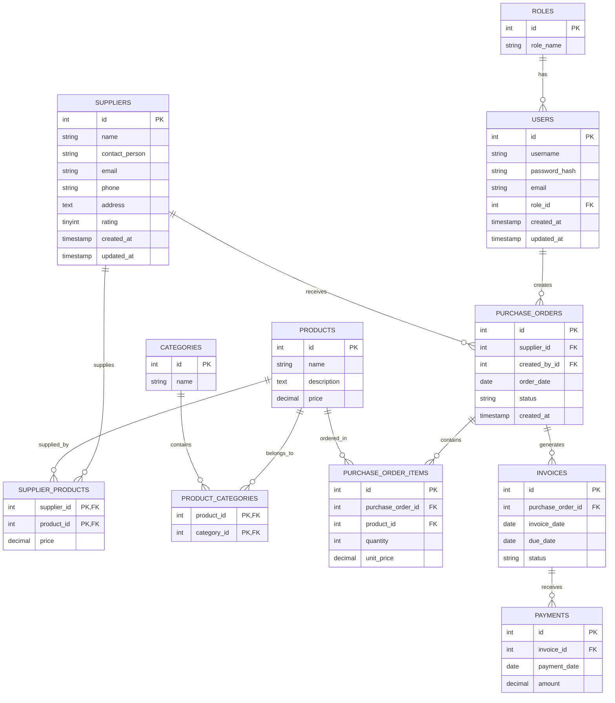

# Database Schema

This document provides a comprehensive overview of all tables in the Supplier & Vendor Management System database and their relationships. The database is configured through the database.module.ts using TypeORM with MySQL as the primary database system. The schema is implemented using TypeORM entities in the various modules of the application, with automatic entity loading enabled for development purposes. The schema includes proper indexing, foreign key constraints, and cascading operations where appropriate to maintain data integrity.

## Entity Relationship Diagram

## Table Details

### `roles`
Manages user roles in the system. This table is referenced by the users table via the role_id foreign key. The role_name must be unique to prevent duplicate roles. This table is populated during database seeding and forms the basis of the role-based access control system.
| Column | Type | Constraints |
|---|---|---|
| `id` | INT | PK, AUTO_INCREMENT |
| `role_name` | VARCHAR(255) | NOT NULL, UNIQUE |

### `users`
Stores user account information with password hashes. The password_hash field uses bcrypt for secure password storage. The table has a foreign key relationship to the roles table to implement role-based access control. Unique constraints are enforced on both username and email to prevent duplicate accounts. The created_at and updated_at fields are automatically managed by TypeORM's CreateDateColumn and UpdateDateColumn decorators.
| Column | Type | Constraints |
|---|---|---|
| `id` | INT | PK, AUTO_INCREMENT |
| `username` | VARCHAR(255) | NOT NULL, UNIQUE |
| `password_hash` | VARCHAR(255) | NOT NULL |
| `email` | VARCHAR(255) | NOT NULL, UNIQUE |
| `role_id` | INT | FK to `roles.id`, NOT NULL |
| `created_at` | TIMESTAMP | DEFAULT CURRENT_TIMESTAMP |
| `updated_at` | TIMESTAMP | DEFAULT CURRENT_TIMESTAMP ON UPDATE CURRENT_TIMESTAMP |

### `suppliers`
Maintains supplier information including contact details and ratings. The email field has a unique constraint to prevent duplicate suppliers. The rating field uses a TINYINT to store ratings on a 0-5 scale. The created_at and updated_at fields track when supplier records were added or modified.
| Column | Type | Constraints |
|---|---|---|
| `id` | INT | PK, AUTO_INCREMENT |
| `name` | VARCHAR(255) | NOT NULL |
| `contact_person` | VARCHAR(255) | Nullable |
| `email` | VARCHAR(255) | NOT NULL, UNIQUE |
| `phone` | VARCHAR(50) | Nullable |
| `address` | TEXT | Nullable |
| `rating` | TINYINT | Nullable, range 0-5 |
| `created_at` | TIMESTAMP | DEFAULT CURRENT_TIMESTAMP |
| `updated_at` | TIMESTAMP | DEFAULT CURRENT_TIMESTAMP ON UPDATE CURRENT_TIMESTAMP |
V
### `products`
Stores product catalog information including name, description, and price. The price field uses DECIMAL(10,2) for accurate financial calculations. This table is referenced by purchase_order_items, supplier_products, and product_categories.
| Column | Type | Constraints |
|---|---|---|
| `id` | INT | PK, AUTO_INCREMENT |
| `name` | VARCHAR(255) | NOT NULL |
| `description` | TEXT | Nullable |
| `price` | DECIMAL(10, 2) | NOT NULL, positive |

### `categories`
Manages product categories for organizing the product catalog. This table is used in conjunction with the product_categories junction table to implement a many-to-many relationship between products and categories.
| Column | Type | Constraints |
|---|---|---|
| `id` | INT | PK, AUTO_INCREMENT |
| `name` | VARCHAR(255) | NOT NULL |

### `product_categories` (Junction table)
Implements the many-to-many relationship between products and categories. This junction table uses composite primary keys and includes foreign key constraints with cascading delete to maintain referential integrity when products or categories are removed.
| Column | Type | Constraints |
|---|---|---|
| `product_id` | INT | PK, FK to `products.id`, CASCADE onDelete |
| `category_id` | INT | PK, FK to `categories.id`, CASCADE onDelete |

### `supplier_products` (Junction table)
Implements the many-to-many relationship between suppliers and products with pricing information. This allows different suppliers to offer the same product at different prices. The table uses composite primary keys and includes foreign key constraints with cascading delete.
| Column | Type | Constraints |
|---|---|---|
| `supplier_id` | INT | PK, FK to `suppliers.id`, CASCADE onDelete |
| `product_id` | INT | PK, FK to `products.id`, CASCADE onDelete |
| `price` | DECIMAL(10, 2) | NOT NULL, positive |

### `purchase_orders`
Manages purchase orders with references to suppliers and the user who created the order. The status field tracks the order lifecycle (Pending, Approved, Shipped, Completed, Cancelled). The order_date represents when the order was placed, and created_at tracks when the record was created in the system.
| Column | Type | Constraints |
|---|---|---|
| `id` | INT | PK, AUTO_INCREMENT |
| `supplier_id` | INT | FK to `suppliers.id`, NOT NULL |
| `created_by_id` | INT | FK to `users.id`, NOT NULL |
| `order_date` | DATE | NOT NULL |
| `status` | VARCHAR(50) | NOT NULL, default 'Pending' |
| `created_at` | TIMESTAMP | DEFAULT CURRENT_TIMESTAMP |

### `purchase_order_items`
Stores individual line items for purchase orders including the product, quantity, and unit price at the time of ordering. This allows tracking of what was ordered at what price, even if product prices change later. The table is tightly linked to both purchase orders and products.
| Column | Type | Constraints |
|---|---|---|
| `id` | INT | PK, AUTO_INCREMENT |
| `purchase_order_id` | INT | FK to `purchase_orders.id`, NOT NULL |
| `product_id` | INT | FK to `products.id`, NOT NULL |
| `quantity` | INT | NOT NULL, positive |
| `unit_price` | DECIMAL(10, 2) | NOT NULL, positive |

### `invoices`
Manages invoices linked to purchase orders with invoice dates, due dates, and status tracking. This table creates the financial relationship between purchase orders and payments. The status field tracks invoice states (Pending, Paid, Overdue, Cancelled).
| Column | Type | Constraints |
|---|---|---|
| `id` | INT | PK, AUTO_INCREMENT |
| `purchase_order_id` | INT | FK to `purchase_orders.id`, NOT NULL |
| `invoice_date` | DATE | NOT NULL |
| `due_date` | DATE | NOT NULL |
| `status` | VARCHAR(50) | NOT NULL, default 'Pending' |

### `payments`
Tracks payments made against invoices with payment dates and amounts. The amount field uses DECIMAL(10,2) for precise financial tracking. This table forms the final link in the financial chain from purchase order to invoice to payment.
| Column | Type | Constraints |
|---|---|---|
| `id` | INT | PK, AUTO_INCREMENT |
| `invoice_id` | INT | FK to `invoices.id`, NOT NULL |
| `payment_date` | DATE | NOT NULL |
| `amount` | DECIMAL(10, 2) | NOT NULL, positive |

## Database Configuration

The database configuration is managed through the database.module.ts file which uses NestJS Config to handle environment variables for database connection parameters. The system is configured to use MySQL with connection parameters specified in environment variables (DB_HOST, DB_PORT, DB_USERNAME, DB_PASSWORD, DB_NAME). The autoLoadEntities option is enabled to automatically load all entities from the application modules. The synchronize option is set to true for development to automatically create tables based on entities, though this should be disabled in production environments in favor of proper migrations.

## Relationship Descriptions

- **Users to Roles**: Many-to-one relationship where each user has one role
- **Users to Purchase Orders**: One-to-many relationship where users create purchase orders
- **Suppliers to Purchase Orders**: One-to-many relationship where suppliers receive orders
- **Suppliers to Supplier Products**: One-to-many relationship for supplier product pricing
- **Products to Supplier Products**: One-to-many relationship with pricing per supplier
- **Products to Product Categories**: Many-to-many relationship through junction table
- **Categories to Product Categories**: One-to-many relationship from category to junction
- **Purchase Orders to Purchase Order Items**: One-to-many relationship for order line items
- **Products to Purchase Order Items**: One-to-many relationship for ordered products
- **Purchase Orders to Invoices**: One-to-many relationship where orders can have multiple invoices
- **Invoices to Payments**: One-to-many relationship for payments against invoices

## Data Integrity Features

- Foreign key constraints enforce referential integrity
- Unique constraints prevent duplicate business entities
- CASCADE onDelete options maintain data consistency when parent records are deleted
- Not NULL constraints ensure essential data is always present
- Proper decimal precision for monetary values
- Timestamps for audit trails and record modification tracking
