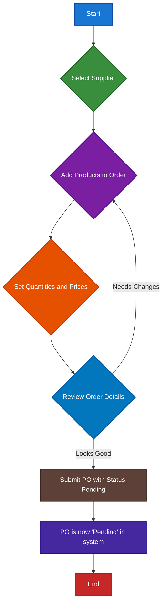

```mermaid
graph TD
    A[Start] --> B{Select Supplier};
    B --> C{Add Products to Order};
    C --> D{Set Quantities and Prices};
    D --> E{Review Order Details};
    E -- Looks Good --> G[Submit PO with Status 'Pending'];
    G --> H[PO is now 'Pending' in system];
    H --> I[End];
    E -- Needs Changes --> C;
    
    style A fill:#1976D2,stroke:#0D47A1,stroke-width:2px,color:#fff
    style B fill:#388E3C,stroke:#1B5E20,stroke-width:2px,color:#fff
    style C fill:#7B1FA2,stroke:#4A148C,stroke-width:2px,color:#fff
    style D fill:#E65100,stroke:#BF360C,stroke-width:2px,color:#fff
    style E fill:#0277BD,stroke:#01579B,stroke-width:2px,color:#fff
    style G fill:#5D4037,stroke:#3E2723,stroke-width:2px,color:#fff
    style H fill:#4527A0,stroke:#311B92,stroke-width:2px,color:#fff
    style I fill:#C62828,stroke:#B71C1C,stroke-width:2px,color:#fff
```