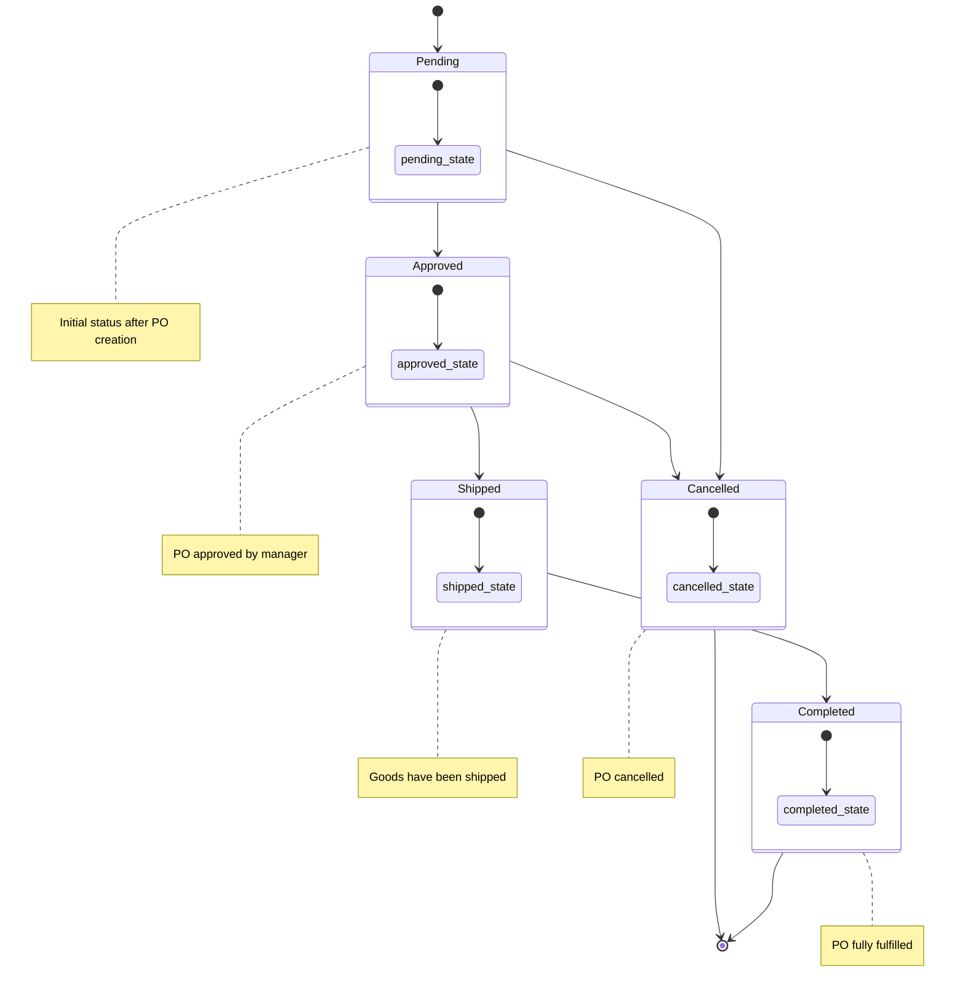

```mermaid
stateDiagram-v2
    [*] --> Pending
    Pending --> Approved
    Pending --> Cancelled
    Approved --> Shipped
    Approved --> Cancelled
    Shipped --> Completed
    Completed --> [*]
    Cancelled --> [*]
    
    state Pending {
        [*] --> pending_state
    }
    state Approved {
        [*] --> approved_state
    }
    state Shipped {
        [*] --> shipped_state
    }
    state Completed {
        [*] --> completed_state
    }
    state Cancelled {
        [*] --> cancelled_state
    }
    
    note right of Pending
        Initial status after PO creation
    end note
    
    note right of Approved
        PO approved by manager
    end note
    
    note right of Shipped
        Goods have been shipped
    end note
    
    note right of Completed
        PO fully fulfilled
    end note
    
    note right of Cancelled
        PO cancelled
    end note
    
    style Pending fill:#1976D2,stroke:#0D47A1,stroke-width:2px
    style Approved fill:#388E3C,stroke:#1B5E20,stroke-width:2px
    style Shipped fill:#7B1FA2,stroke:#4A148C,stroke-width:2px
    style Completed fill:#0277BD,stroke:#01579B,stroke-width:2px
    style Cancelled fill:#C62828,stroke:#B71C1C,stroke-width:2px
```