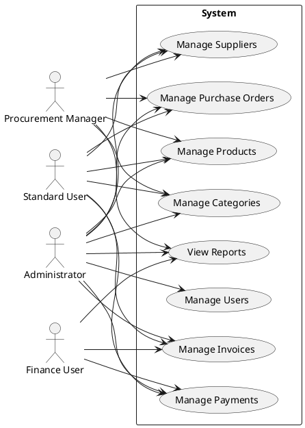
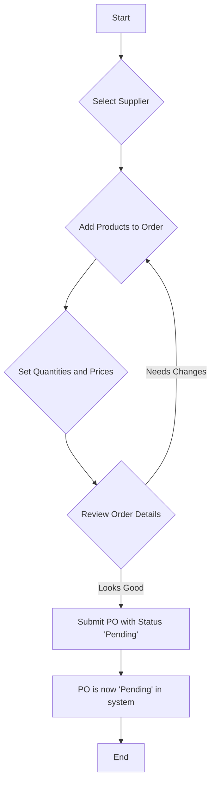
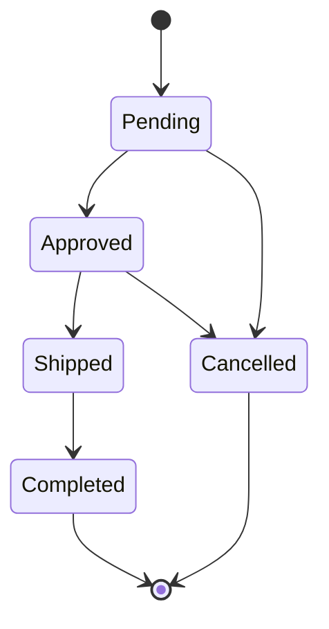

# Feature Overview (FRD)

This document shows what the Supplier & Vendor Management System does from a user's point of view, covering all available features and functionalities. The system is built using the NestJS framework with a modular architecture that separates concerns into distinct modules for authentication, users, suppliers, products, purchase orders, invoices, and payments.

### User Roles

The system implements role-based access control with the following roles that are stored in the roles table and assigned to users through the roleId field:

| Role | Key Responsibilities |
|------|---------------------|
| **Administrator** | Full system access, including user management, supplier management, product management, purchase order management, invoice management, and payment processing. Access to seeding functionality and system configuration. |
| **Procurement Manager** | Manages suppliers, products, categories, and purchase orders. Can view invoices and payments. Can create and update purchase orders on behalf of the organization. |
| **Finance User** | Manages invoices and payments. Can view suppliers, products, and purchase orders. Responsible for payment processing and invoice tracking. |
| **Standard User** | Read-only access to view suppliers, products, purchase orders, invoices, and payments. Limited to viewing and searching functionality. |

### Main Features (Use Cases)

### Core Modules

#### 1. Authentication & Authorization Module
- User login with JWT token-based authentication
- Secure password hashing with bcrypt in the UsersService
- Role-based access control implemented through AuthMiddleware
- Input validation using class-validator in SignInDto
- Token expiration configured to 1 hour in auth module
- Middleware that validates Bearer tokens on protected routes
- Global exception handling for unauthorized access

#### 2. User Management Module
- Create users with username, email, password, and roleId
- Read all users and their roles through dedicated endpoints
- Update user information including username, email, password, and role
- Delete users from the system
- Fetch all available roles to assign to users
- Secure password hashing using bcrypt with 10 rounds
- User validation to check for existing usernames and emails
- Type-safe DTOs using class-validator for input validation

#### 3. Supplier Management Module
- Create suppliers with name, contact information, email, phone, address, and rating
- Read all suppliers or specific supplier by ID
- Update supplier information as needed
- Delete suppliers from the system
- Track supplier rating for performance evaluation
- Unique email constraint to prevent duplicate suppliers
- Relationship with purchase orders and supplier products
- Type-safe DTOs with validation for creating and updating suppliers

#### 4. Product Management Module
- Create products with name, description, and price
- Read all products or specific product by ID
- Update product information including name, description, and price
- Delete products from the system
- Manage relationships between suppliers and products
- Integration with purchase order items for tracking orders
- Type-safe DTOs with validation for product operations
- Support for multiple suppliers offering the same product at different prices

#### 5. Category Management Module
- Create product categories to organize products
- Read all categories or specific category by ID
- Associate products with multiple categories through junction table
- Manage category-to-product relationships
- Integration with Product entities for organization
- Support for hierarchical product organization through categories
- Type-safe DTOs for category operations

#### 6. Purchase Order Management Module
- Create purchase orders with supplier, creator, date, and line items
- Track purchase order status through its lifecycle (Pending, Approved, Shipped, Completed, Cancelled)
- Associate purchase orders with suppliers and creating users
- Add multiple line items with products, quantities, and unit prices
- Update purchase order status as it moves through workflow
- Integration with invoices and payments for financial tracking
- Type-safe DTOs with nested validation for purchase order items
- Transactional operations to ensure data consistency

#### 7. Invoice Management Module
- Create invoices linked to purchase orders with date and status
- Track invoice status (Pending, Paid, Overdue, Cancelled)
- View detailed invoice information including associated purchase order
- Update invoice status as payments are processed
- Integration with payment module for tracking payments against invoices
- Type-safe DTOs with validation for invoice creation
- Automatic association with purchase orders through foreign key

#### 8. Payment Processing Module
- Record payments against specific invoices with date and amount
- Track payment amounts and dates for financial reporting
- View payment history for specific invoices
- Multiple payments allowed per invoice for partial payments
- Integration with invoice module for payment tracking
- Type-safe DTOs with validation for payment creation
- Decimal precision handling for accurate monetary calculations

### Purchase Order Workflow

This is the main process for creating and managing a purchase order in the system.

#### Activity Flow

#### PO Status Lifecycle
A purchase order moves through these states from creation to completion.

### Database Seeding
The system includes comprehensive database seeding functionality located in the src directory with multiple seeding scripts:
- seed.ts - Basic seeding for minimal data setup
- full-seed.ts - More comprehensive data population (not shown in codebase)
- comprehensive-seed.ts - Complete dataset with interconnected entities
- Scripts seed roles, users with hashed passwords, suppliers, products, categories, purchase orders with items, invoices, and payments
- Seeding uses the same service interfaces as the application for consistency
- Scripts are accessible through npm run scripts defined in package.json

This seeding functionality is useful for development, testing, and demonstration purposes, providing realistic sample data to work with.

### API Documentation
All system functionality is exposed through a RESTful API with comprehensive documentation that follows industry standards. The API is defined in the modules with controllers handling the endpoints, services implementing the business logic, and entities defining the data models. All endpoints are secured with JWT authentication middleware and follow consistent patterns across modules.