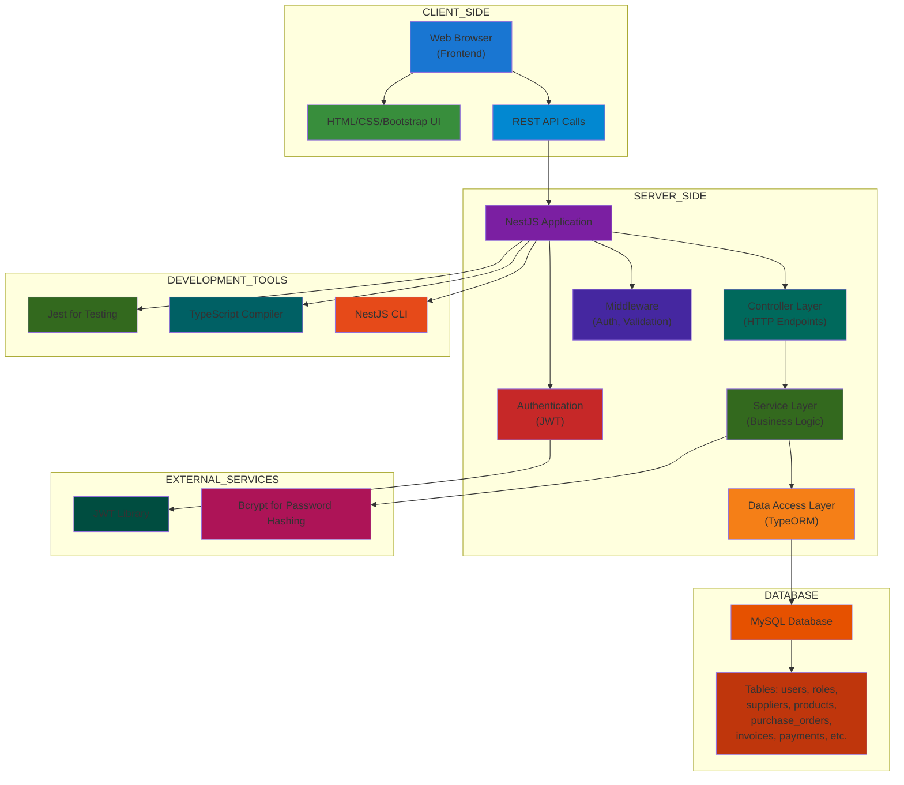

```mermaid
graph TD
    subgraph "CLIENT_SIDE"
        A["Web Browser<br/>(Frontend)"]
        B["HTML/CSS/Bootstrap UI"]
        C["REST API Calls"]
    end
    
    subgraph "SERVER_SIDE"
        D["NestJS Application"]
        E["Controller Layer<br/>(HTTP Endpoints)"]
        F["Service Layer<br/>(Business Logic)"]
        G["Data Access Layer<br/>(TypeORM)"]
        H["Authentication<br/>(JWT)"]
        I["Middleware<br/>(Auth, Validation)"]
    end
    
    subgraph "DATABASE"
        J["MySQL Database"]
        K["Tables: users, roles,<br/>suppliers, products,<br/>purchase_orders,<br/>invoices, payments, etc."]
    end
    
    subgraph "EXTERNAL_SERVICES"
        L["JWT Library"]
        M["Bcrypt for Password Hashing"]
    end
    
    subgraph "DEVELOPMENT_TOOLS"
        N["Jest for Testing"]
        O["TypeScript Compiler"]
        P["NestJS CLI"]
    end
    
    A --> B
    A --> C
    C --> D
    D --> E
    D --> H
    D --> I
    E --> F
    H --> L
    F --> G
    G --> J
    J --> K
    F --> M
    D --> N
    D --> O
    D --> P
    
    style A fill:#1976D2
    style B fill:#388E3C
    style C fill:#0288D1
    style D fill:#7B1FA2
    style E fill:#00695C
    style F fill:#33691E
    style G fill:#F57F17
    style H fill:#C62828
    style I fill:#4527A0
    style J fill:#E65100
    style K fill:#BF360C
    style L fill:#004D40
    style M fill:#AD1457
    style N fill:#33691E
    style O fill:#006064
    style P fill:#E64A19
```