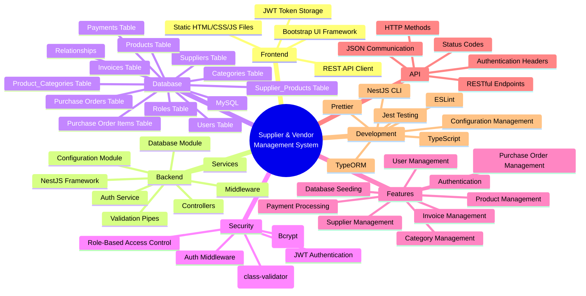

```mermaid
mindmap
  root((Supplier & Vendor<br/>Management System))
    Frontend
      Static HTML/CSS/JS Files
      Bootstrap UI Framework
      REST API Client
      JWT Token Storage
    Backend
      NestJS Framework
      Controllers
      Services
      Middleware
      Auth Service
      Validation Pipes
      Configuration Module
      Database Module
    Database
      MySQL
      Users Table
      Roles Table
      Suppliers Table
      Products Table
      Categories Table
      Supplier_Products Table
      Product_Categories Table
      Purchase Orders Table
      Purchase Order Items Table
      Invoices Table
      Payments Table
      Relationships
    Security
      JWT Authentication
      Password Hashing (Bcrypt)
      Role-Based Access Control
      Input Validation (class-validator)
      Auth Middleware
    Features
      User Management
      Supplier Management
      Product Management
      Category Management
      Purchase Order Management
      Invoice Management
      Payment Processing
      Authentication
      Database Seeding
    API
      RESTful Endpoints
      JSON Communication
      HTTP Methods
      Status Codes
      Authentication Headers
    Development
      Jest Testing
      TypeScript
      TypeORM
      ESLint
      Prettier
      NestJS CLI
      Configuration Management
```

