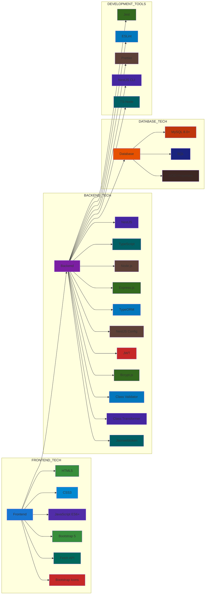

```mermaid
graph LR
    A[Frontend] --> B[Backend]
    B --> C[Database]
    
    subgraph "FRONTEND_TECH"
        A --> A1[HTML5]
        A --> A2[CSS3]
        A --> A3[JavaScript ES6+]
        A --> A4[Bootstrap 5]
        A --> A5[Fetch API]
        A --> A6[Bootstrap Icons]
    end
    
    subgraph "BACKEND_TECH"
        B --> B1[NestJS]
        B --> B2[TypeScript]
        B --> B3[Node.js]
        B --> B4[Express.js]
        B --> B5[TypeORM]
        B --> B6[NestJS Config]
        B --> B7[JWT]
        B --> B8[Bcrypt.js]
        B --> B9[Class Validator]
        B --> B10[Class Transformer]
        B --> B11[Jsonwebtoken]
    end
    
    subgraph "DATABASE_TECH"
        C --> C1[MySQL 8.0+]
        C --> C2[SQL]
        C --> C3[ACID Properties]
    end
    
    subgraph "DEVELOPMENT_TOOLS"
        B --> D1[Jest]
        B --> D2[ESLint]
        B --> D3[Prettier]
        B --> D4[NestJS CLI]
        B --> D5[TS-Node]
    end
    
    style A fill:#1976D2
    style B fill:#7B1FA2
    style C fill:#E65100
    style A1 fill:#388E3C
    style A2 fill:#0288D1
    style A3 fill:#512DA8
    style A4 fill:#388E3C
    style A5 fill:#00695C
    style A6 fill:#C62828
    style B1 fill:#4527A0
    style B2 fill:#006064
    style B3 fill:#5D4037
    style B4 fill:#33691E
    style B5 fill:#0277BD
    style B6 fill:#5D4037
    style B7 fill:#C62828
    style B8 fill:#33691E
    style B9 fill:#0277BD
    style B10 fill:#4527A0
    style B11 fill:#006064
    style C1 fill:#BF360C
    style C2 fill:#1A237E
    style C3 fill:#3E2723
    style D1 fill:#33691E
    style D2 fill:#0277BD
    style D3 fill:#5D4037
    style D4 fill:#4527A0
    style D5 fill:#006064
```