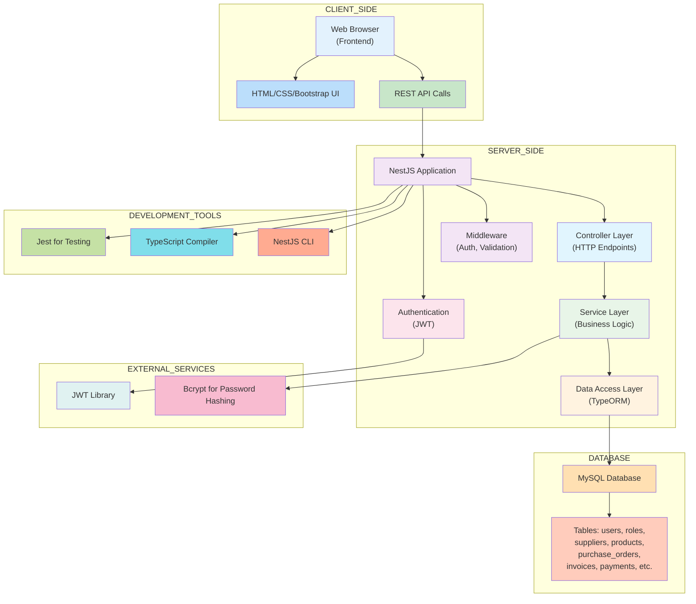
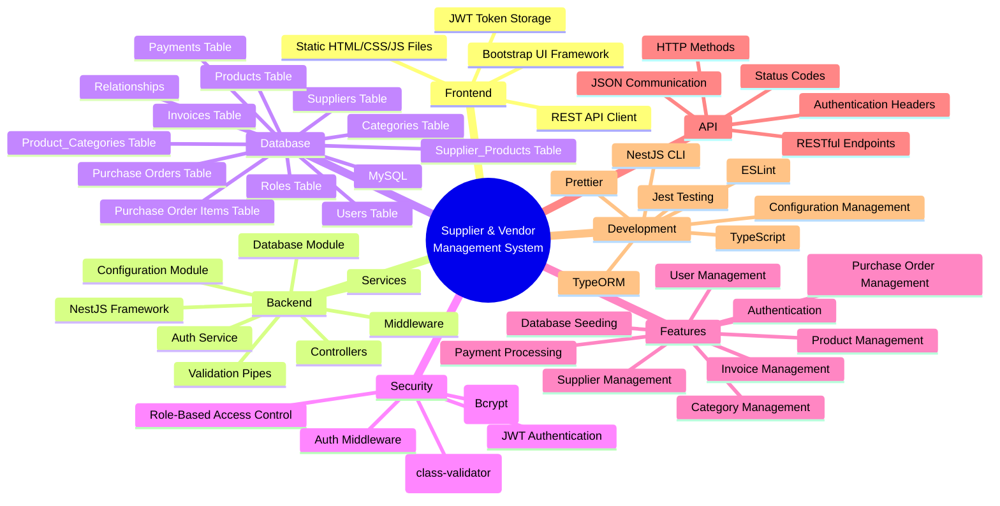
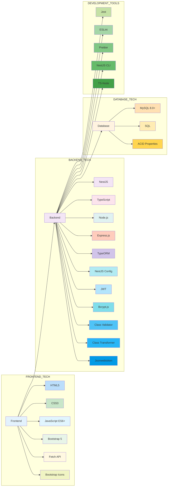

# System Overview

## Complete System Architecture

## System Components Breakdown

## Technology Stack

## Module Architecture

The system is organized into the following modules following NestJS modular architecture pattern with Controllers, Services, Entities, DTOs, and Middleware components for each module. The modules are all contained within the `src/modules` directory and have the following structure with their respective dependencies and relationships in the AppModule:

1. **Auth Module** - Handles authentication and JWT token generation
   - AuthController (auth.controller.ts)
   - AuthService (auth.service.ts)
   - SignInDto (dto/sign-in.dto.ts)
   - Has dependency on UsersModule for user validation

2. **Users Module** - Manages user accounts and roles
   - UsersController (users.controller.ts)
   - UsersService (users.service.ts)
   - User Entity (entities/user.entity.ts)
   - Role Entity (entities/role.entity.ts)
   - DTOs (dto/create-user.dto.ts, dto/update-user.dto.ts)

3. **Suppliers Module** - Manages supplier information
   - SuppliersController (suppliers.controller.ts)
   - SuppliersService (suppliers.service.ts)
   - Supplier Entity (entities/supplier.entity.ts)
   - SupplierProduct Entity (entities/supplier-product.entity.ts)
   - DTOs (dto/create-supplier.dto.ts, dto/update-supplier.dto.ts)

4. **Products Module** - Manages products and categories
   - ProductsController (products.controller.ts)
   - ProductsService (products.service.ts)
   - Product Entity (entities/product.entity.ts)
   - Category Entity (entities/category.entity.ts)
   - ProductCategory Entity (entities/product-category.entity.ts)
   - DTOs (dto/create-product.dto.ts, dto/update-product.dto.ts, dto/create-category.dto.ts)

5. **Purchase Orders Module** - Handles purchase order creation and management
   - PurchaseOrdersController (purchase-orders.controller.ts)
   - PurchaseOrdersService (purchase-orders.service.ts)
   - PurchaseOrder Entity (entities/purchase-order.entity.ts)
   - PurchaseOrderItem Entity (entities/purchase-order-item.entity.ts)
   - DTOs (dto/create-purchase-order.dto.ts)

6. **Invoices Module** - Manages invoice generation and tracking
   - InvoicesController (invoices.controller.ts)
   - InvoicesService (invoices.service.ts)
   - Invoice Entity (entities/invoice.entity.ts)
   - DTOs (dto/create-invoice.dto.ts)

7. **Payments Module** - Tracks payment records
   - PaymentsController (payments.controller.ts)
   - PaymentsService (payments.service.ts)
   - Payment Entity (entities/payment.entity.ts)
   - DTOs (dto/create-payment.dto.ts)

## Database Module

The application uses a dedicated DatabaseModule which handles the TypeORM configuration using NestJS Config for environment variables. It connects to MySQL database and automatically loads entities using the synchronize option for development purposes. This module is imported in the main AppModule and provides common database functionality across all other modules.

## Main Application Structure

The main application is structured as follows in the `src` directory:
- `app.module.ts` - Main application module that imports and configures all other modules
- `main.ts` - Entry point that sets up the NestJS application with global prefix `/api`, CORS, validation pipes, and static assets
- `middleware/auth.middleware.ts` - Global authentication middleware that verifies JWT tokens
- `database/database.module.ts` - Database configuration module using TypeORM and NestJS Config
- `seed.ts`, `full-seed.ts`, `comprehensive-seed.ts` - Database seeding scripts in the src directory

## Development & Testing

The system includes a comprehensive testing suite using Jest configured in the `tests` directory with separate configuration files for different types of tests. Testing includes unit tests for individual services with mock repositories to ensure isolated testing of business logic. The testing structure includes specific test files for each module such as auth.service.spec.ts, suppliers.service.spec.ts, and users.service.spec.ts in the tests directory. Development tools include ESLint for code quality, Prettier for code formatting, and NestJS CLI for project scaffolding and building. TypeScript is used throughout the application for type safety and better developer experience. All configuration is managed through package.json scripts for building, testing, and running the application.

## Seeding Scripts

The system provides comprehensive database seeding scripts located in the src directory including seed.ts, full-seed.ts, and comprehensive-seed.ts. These scripts allow developers to populate the database with sample data for roles, users, suppliers, products, categories, purchase orders, invoices, and payments. The seeding scripts are accessed through npm scripts defined in package.json as `npm run seed`, `npm run seed:full`, and `npm run seed:comprehensive`. These scripts are essential for setting up development environments, testing functionality with realistic data, and demonstrating system capabilities with sample data. The comprehensive seeding script creates a complete dataset with interconnected entities that reflect real-world usage scenarios.

## API Structure

All API endpoints are prefixed with `/api/` as configured in main.ts and organized by module following RESTful principles. The API endpoints include `/api/auth` for authentication endpoints, `/api/users` for user management endpoints with create, read, update, and role management capabilities, `/api/suppliers` for supplier management endpoints with create, read, update, and delete operations, `/api/products` for product and category management endpoints with separate routes for categories, `/api/purchase-orders` for purchase order endpoints with status update functionality, `/api/invoices` for invoice endpoints with status update capabilities, and `/api/payments` for payment endpoints with invoice-specific queries. Each endpoint follows standard HTTP methods and status code conventions with proper validation and error handling throughout the application.

## Security Features

- JWT-based authentication for all protected endpoints implemented through the AuthMiddleware and AuthModule
- Bcrypt password hashing for secure password storage in the UsersService
- Input validation using class-validator across all DTOs to prevent invalid data entry
- SQL injection prevention through TypeORM's parameterized queries
- Global validation pipes in main.ts that handle input sanitization and whitelisting
- Authorization header validation requiring Bearer tokens for protected routes
- Type safety through TypeScript reducing runtime errors and improving security