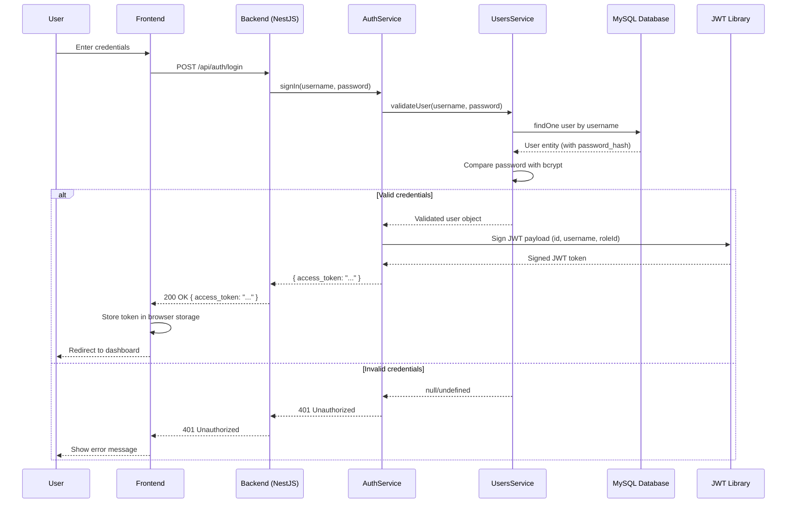

```mermaid
sequenceDiagram
    participant U as User
    participant F as Frontend
    participant B as Backend (NestJS)
    participant AuthS as AuthService
    participant UserS as UsersService
    participant DB as MySQL Database
    participant JWT as JWT Library
    
    U->>F: Enter credentials
    F->>B: POST /api/auth/login
    B->>AuthS: signIn(username, password)
    AuthS->>UserS: validateUser(username, password)
    UserS->>DB: findOne user by username
    DB-->>UserS: User entity (with password_hash)
    UserS->>UserS: Compare password with bcrypt
    alt Valid credentials
        UserS-->>AuthS: Validated user object
        AuthS->>JWT: Sign JWT payload (id, username, roleId)
        JWT-->>AuthS: Signed JWT token
        AuthS-->>B: { access_token: "..." }
        B-->>F: 200 OK { access_token: "..." }
        F->>F: Store token in browser storage
        F-->>U: Redirect to dashboard
    else Invalid credentials
        UserS-->>AuthS: null/undefined
        AuthS-->>B: 401 Unauthorized
        B-->>F: 401 Unauthorized
        F-->>U: Show error message
    end
```