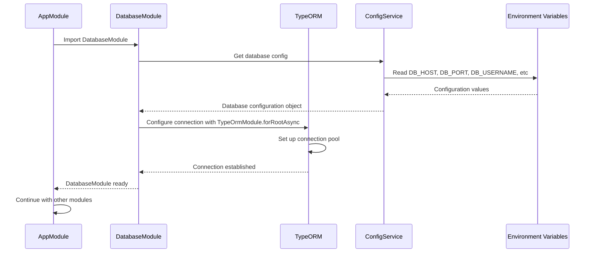

```mermaid
sequenceDiagram
    participant App as AppModule
    participant DBMod as DatabaseModule
    participant TypeOrm as TypeORM
    participant Config as ConfigService
    participant Env as Environment Variables
    
    App->>DBMod: Import DatabaseModule
    DBMod->>Config: Get database config
    Config->>Env: Read DB_HOST, DB_PORT, DB_USERNAME, etc
    Env-->>Config: Configuration values
    Config-->>DBMod: Database configuration object
    DBMod->>TypeOrm: Configure connection with TypeOrmModule.forRootAsync
    TypeOrm->>TypeOrm: Set up connection pool
    TypeOrm-->>DBMod: Connection established
    DBMod-->>App: DatabaseModule ready
    App->>App: Continue with other modules
```