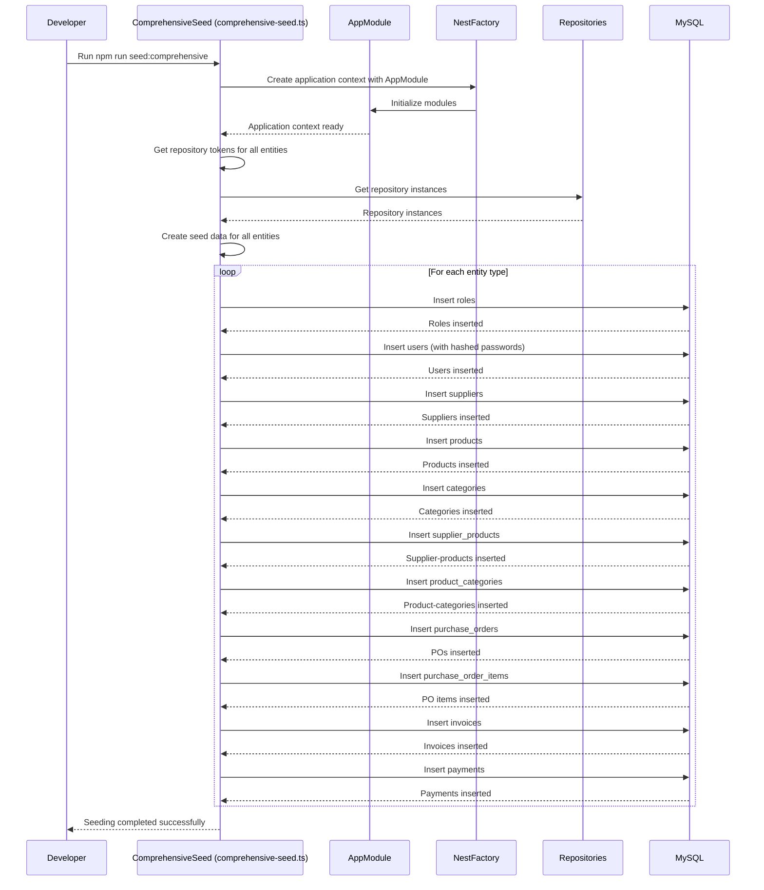

```mermaid
sequenceDiagram
    participant D as Developer
    participant S as ComprehensiveSeed (comprehensive-seed.ts)
    participant App as AppModule
    participant NF as NestFactory
    participant Repos as Repositories
    participant DB as MySQL
    
    D->>S: Run npm run seed:comprehensive
    S->>NF: Create application context with AppModule
    NF->>App: Initialize modules
    App-->>S: Application context ready
    S->>S: Get repository tokens for all entities
    S->>Repos: Get repository instances
    Repos-->>S: Repository instances
    S->>S: Create seed data for all entities
    
    loop For each entity type
        S->>DB: Insert roles
        DB-->>S: Roles inserted
        S->>DB: Insert users (with hashed passwords)
        DB-->>S: Users inserted
        S->>DB: Insert suppliers
        DB-->>S: Suppliers inserted
        S->>DB: Insert products
        DB-->>S: Products inserted
        S->>DB: Insert categories
        DB-->>S: Categories inserted
        S->>DB: Insert supplier_products
        DB-->>S: Supplier-products inserted
        S->>DB: Insert product_categories
        DB-->>S: Product-categories inserted
        S->>DB: Insert purchase_orders
        DB-->>S: POs inserted
        S->>DB: Insert purchase_order_items
        DB-->>S: PO items inserted
        S->>DB: Insert invoices
        DB-->>S: Invoices inserted
        S->>DB: Insert payments
        DB-->>S: Payments inserted
    end
    S-->>D: Seeding completed successfully
```