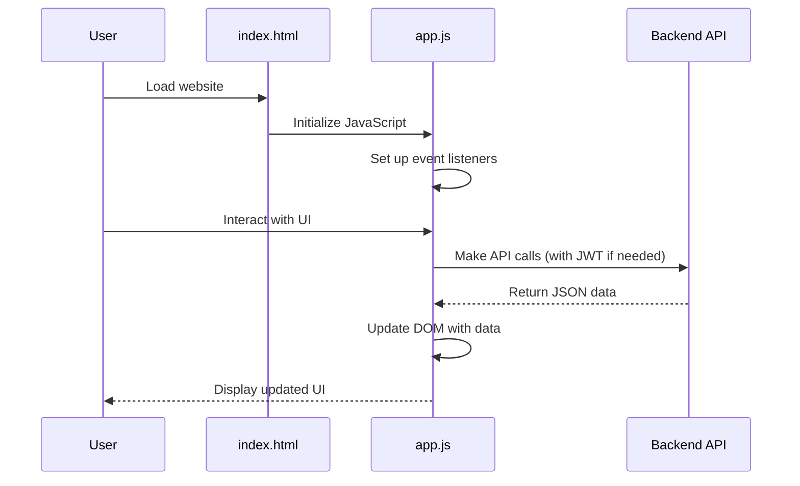

```mermaid
sequenceDiagram
    participant U as User
    participant HTML as index.html
    participant JS as app.js
    participant API as Backend API
    
    U->>HTML: Load website
    HTML->>JS: Initialize JavaScript
    JS->>JS: Set up event listeners
    U->>JS: Interact with UI
    JS->>API: Make API calls (with JWT if needed)
    API-->>JS: Return JSON data
    JS->>JS: Update DOM with data
    JS-->>U: Display updated UI
```