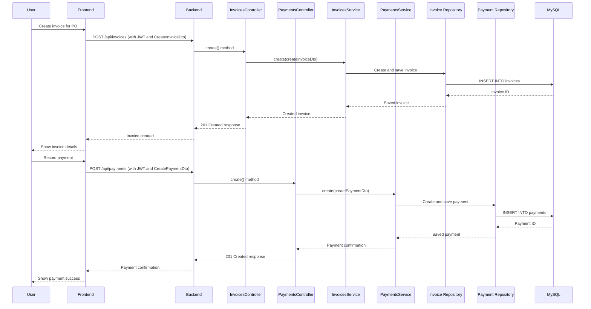

```mermaid
sequenceDiagram
    participant U as User
    participant F as Frontend
    participant B as Backend
    participant InvCtrl as InvoicesController
    participant PayCtrl as PaymentsController
    participant InvSvc as InvoicesService
    participant PaySvc as PaymentsService
    participant InvRepo as Invoice Repository
    participant PayRepo as Payment Repository
    participant DB as MySQL
    
    U->>F: Create invoice for PO
    F->>B: POST /api/invoices (with JWT and CreateInvoiceDto)
    B->>InvCtrl: create() method
    InvCtrl->>InvSvc: create(createInvoiceDto)
    InvSvc->>InvRepo: Create and save invoice
    InvRepo->>DB: INSERT INTO invoices
    DB-->>InvRepo: Invoice ID
    InvRepo-->>InvSvc: Saved invoice
    InvSvc-->>InvCtrl: Created invoice
    InvCtrl-->>B: 201 Created response
    B-->>F: Invoice created
    F-->>U: Show invoice details
    
    U->>F: Record payment
    F->>B: POST /api/payments (with JWT and CreatePaymentDto)
    B->>PayCtrl: create() method
    PayCtrl->>PaySvc: create(createPaymentDto)
    PaySvc->>PayRepo: Create and save payment
    PayRepo->>DB: INSERT INTO payments
    DB-->>PayRepo: Payment ID
    PayRepo-->>PaySvc: Saved payment
    PaySvc-->>PayCtrl: Payment confirmation
    PayCtrl-->>B: 201 Created response
    B-->>F: Payment confirmation
    F-->>U: Show payment success
```