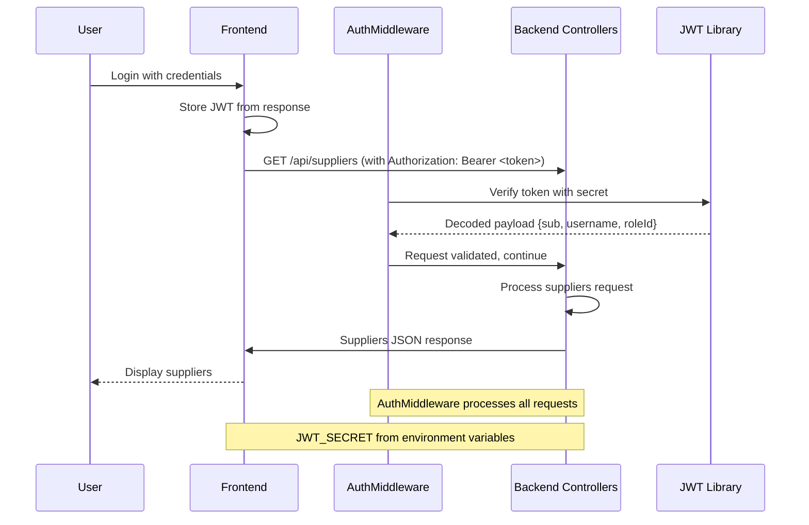

```mermaid
sequenceDiagram
    participant U as User
    participant F as Frontend
    participant AuthM as AuthMiddleware
    participant B as Backend Controllers
    participant JWT_LIB as JWT Library
    
    U->>F: Login with credentials
    F->>F: Store JWT from response
    F->>B: GET /api/suppliers (with Authorization: Bearer <token>)
    AuthM->>JWT_LIB: Verify token with secret
    JWT_LIB-->>AuthM: Decoded payload {sub, username, roleId}
    AuthM->>B: Request validated, continue
    B->>B: Process suppliers request
    B->>F: Suppliers JSON response
    F-->>U: Display suppliers
    
    Note over AuthM, B: AuthMiddleware processes all requests
    Note over F, B: JWT_SECRET from environment variables
```