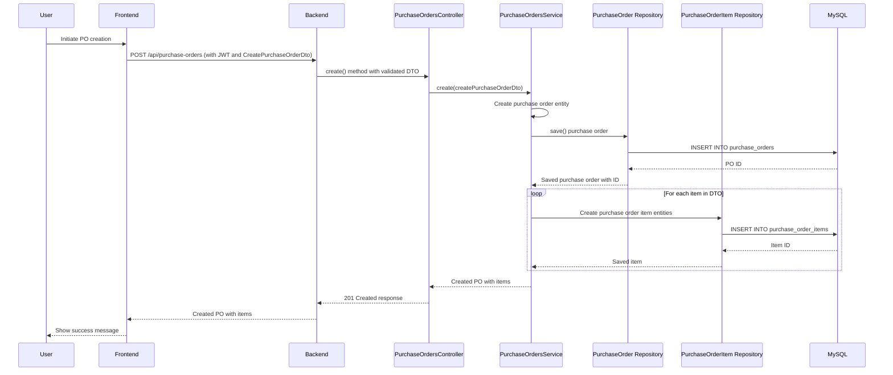

```mermaid
sequenceDiagram
    participant U as User
    participant F as Frontend
    participant B as Backend
    participant Ctrl as PurchaseOrdersController
    participant Svc as PurchaseOrdersService
    participant PORepo as PurchaseOrder Repository
    participant ItemRepo as PurchaseOrderItem Repository
    participant DB as MySQL
    
    U->>F: Initiate PO creation
    F->>B: POST /api/purchase-orders (with JWT and CreatePurchaseOrderDto)
    B->>Ctrl: create() method with validated DTO
    Ctrl->>Svc: create(createPurchaseOrderDto)
    Svc->>Svc: Create purchase order entity
    Svc->>PORepo: save() purchase order
    PORepo->>DB: INSERT INTO purchase_orders
    DB-->>PORepo: PO ID
    PORepo-->>Svc: Saved purchase order with ID
    
    loop For each item in DTO
        Svc->>ItemRepo: Create purchase order item entities
        ItemRepo->>DB: INSERT INTO purchase_order_items
        DB-->>ItemRepo: Item ID
        ItemRepo-->>Svc: Saved item
    end
    
    Svc-->>Ctrl: Created PO with items
    Ctrl-->>B: 201 Created response
    B-->>F: Created PO with items
    F-->>U: Show success message
```