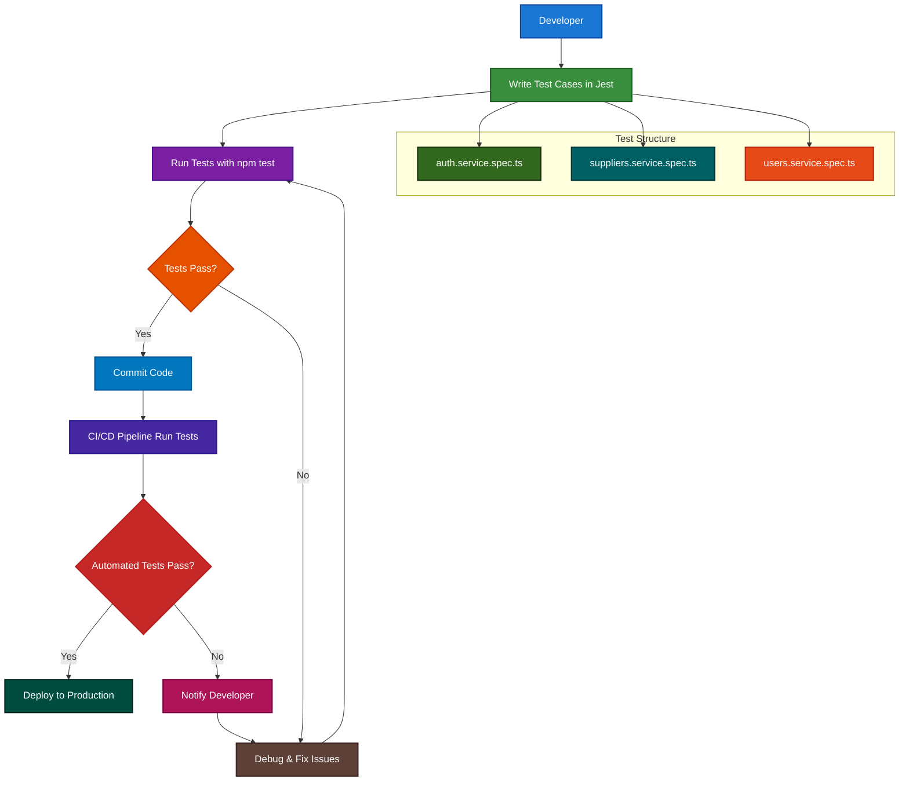

```mermaid
flowchart TD
    A[Developer] --> B[Write Test Cases in Jest]
    B --> C[Run Tests with npm test]
    C --> D{Tests Pass?}
    D -- Yes --> E[Commit Code]
    D -- No --> F[Debug & Fix Issues]
    F --> C
    E --> G[CI/CD Pipeline Run Tests]
    G --> H{Automated Tests Pass?}
    H -- Yes --> I[Deploy to Production]
    H -- No --> J[Notify Developer]
    J --> F
    
    subgraph "Test Structure"
        K[auth.service.spec.ts]
        L[suppliers.service.spec.ts]
        M[users.service.spec.ts]
    end
    B --> K
    B --> L
    B --> M
    
    style A fill:#1976D2,stroke:#0D47A1,stroke-width:2px,color:#fff
    style B fill:#388E3C,stroke:#1B5E20,stroke-width:2px,color:#fff
    style C fill:#7B1FA2,stroke:#4A148C,stroke-width:2px,color:#fff
    style D fill:#E65100,stroke:#BF360C,stroke-width:2px,color:#fff
    style E fill:#0277BD,stroke:#01579B,stroke-width:2px,color:#fff
    style F fill:#5D4037,stroke:#3E2723,stroke-width:2px,color:#fff
    style G fill:#4527A0,stroke:#311B92,stroke-width:2px,color:#fff
    style H fill:#C62828,stroke:#B71C1C,stroke-width:2px,color:#fff
    style I fill:#004D40,stroke:#00251A,stroke-width:2px,color:#fff
    style J fill:#AD1457,stroke:#7A003C,stroke-width:2px,color:#fff
    style K fill:#33691E,stroke:#1A320F,stroke-width:2px,color:#fff
    style L fill:#006064,stroke:#00373A,stroke-width:2px,color:#fff
    style M fill:#E64A19,stroke:#B7260D,stroke-width:2px,color:#fff
```