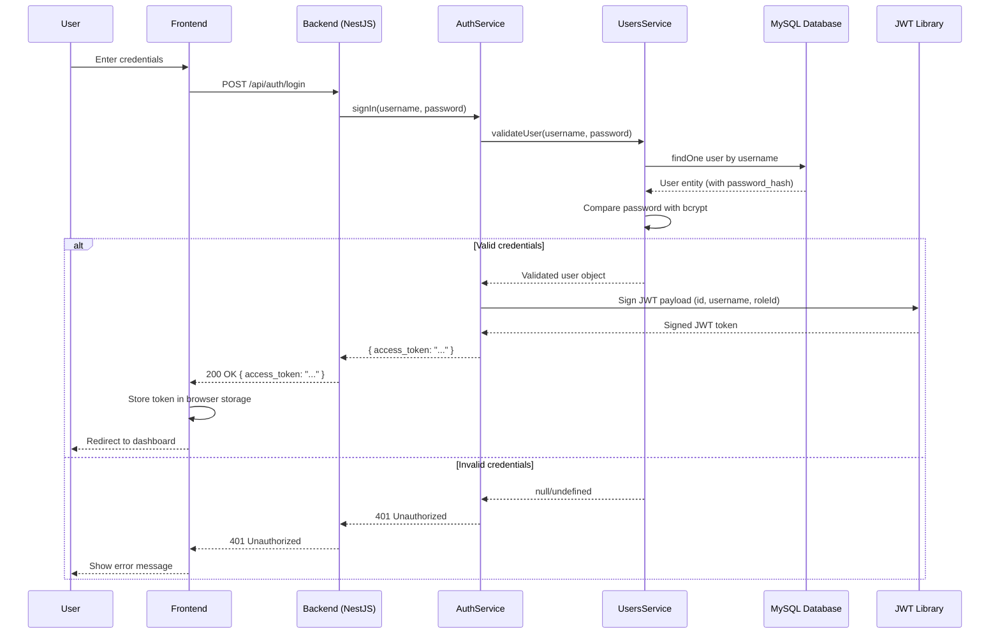
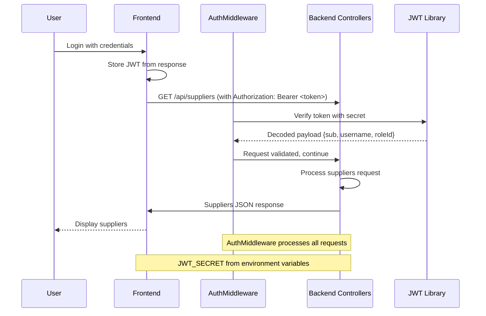
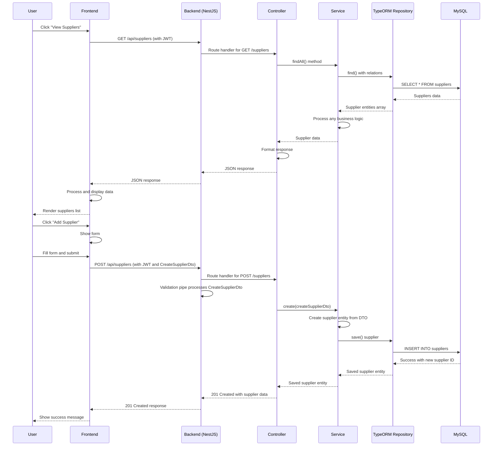
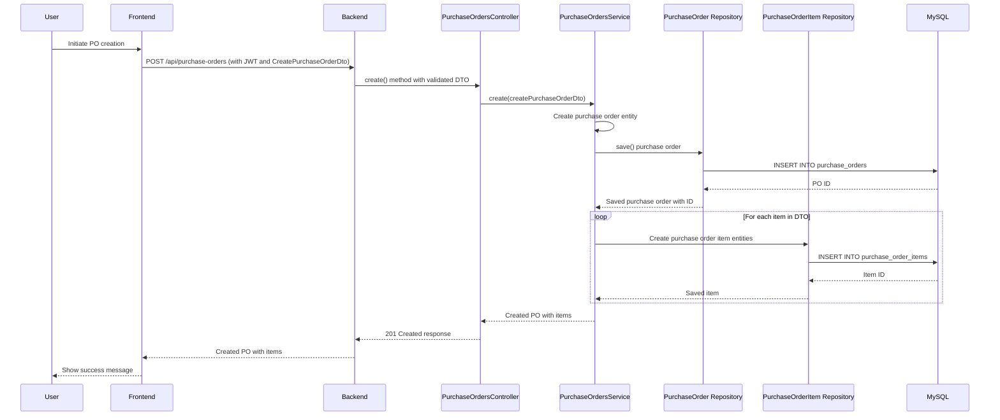
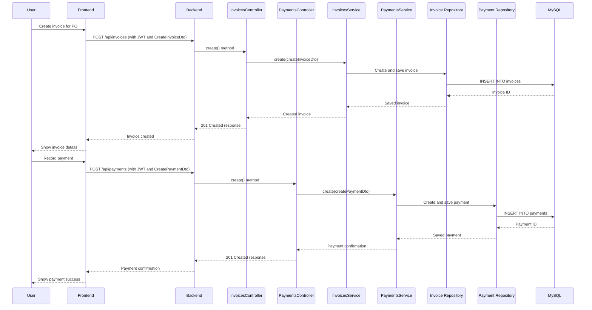
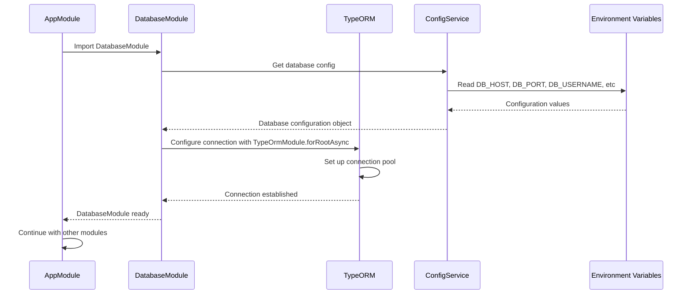
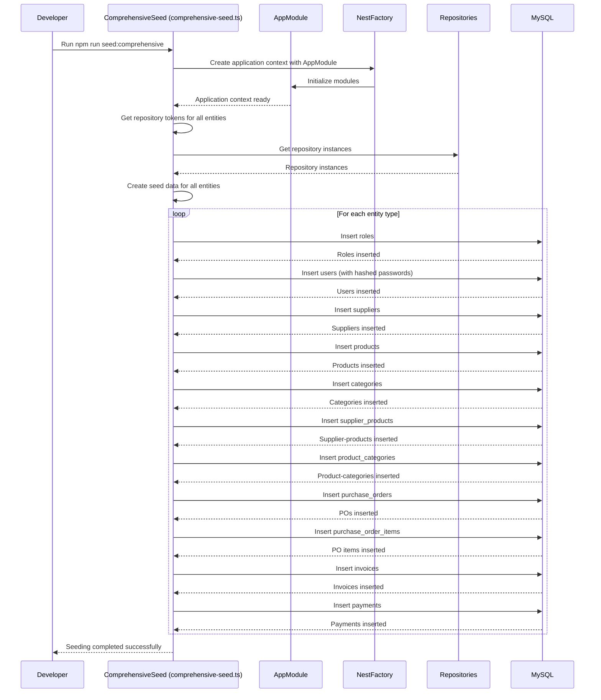
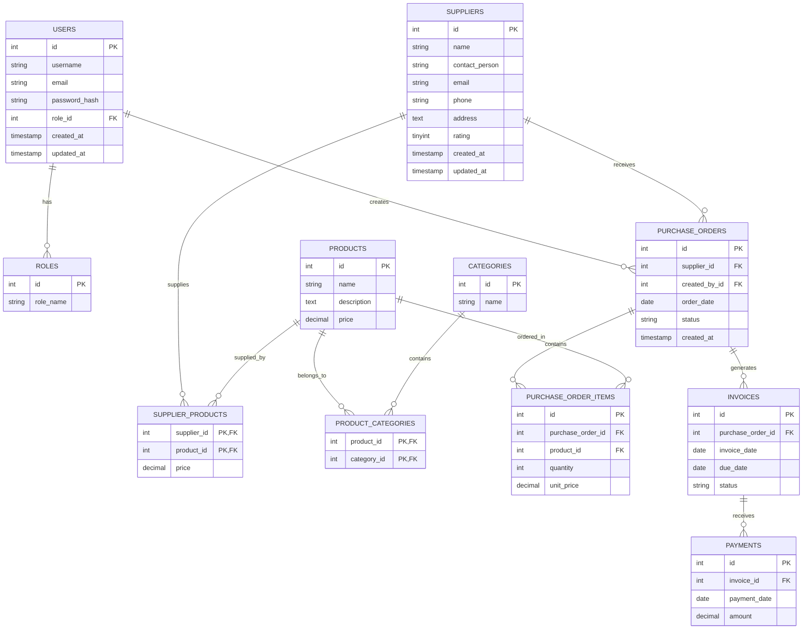
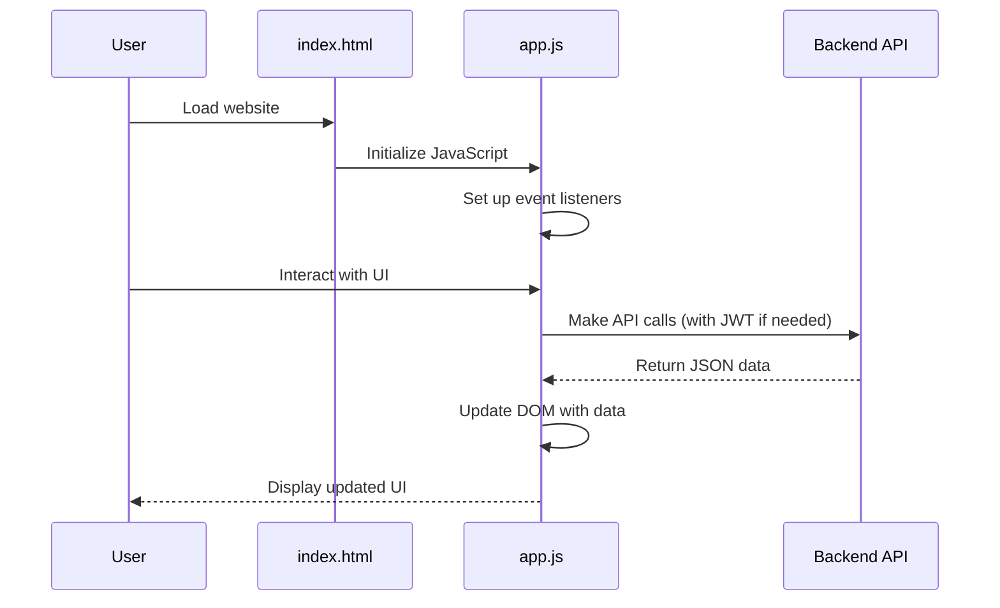
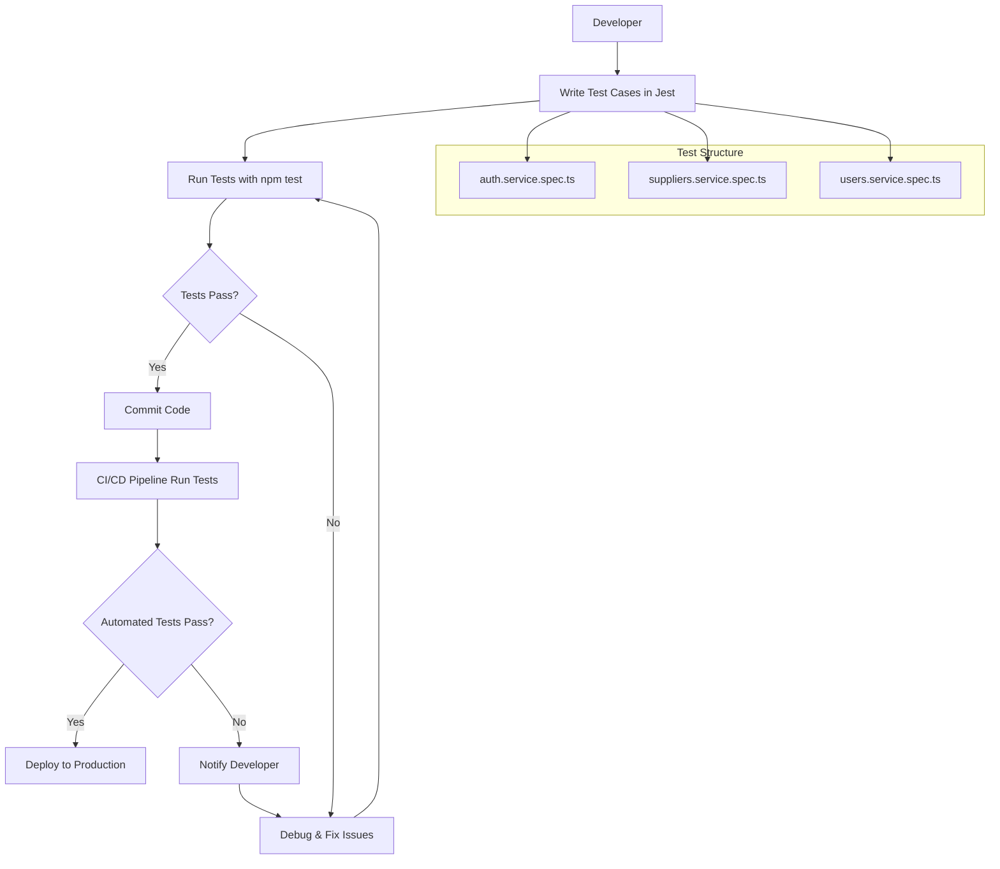

# Technical Workflows

## Application Architecture Overview

The Supplier & Vendor Management System is built using NestJS framework with a modular architecture. The main application is configured in `app.module.ts` which imports all feature modules and the database module. The application uses TypeORM for database operations, JWT for authentication, and class-validator for input validation. The main entry point is in `main.ts` where the application is configured with global prefix `/api`, CORS, validation pipes, and static assets for the frontend.

## Authentication & Authorization Workflow

## JWT Token Workflow

## API Request/Response Workflow

## Purchase Order Creation Workflow

## Invoice & Payment Workflow

## Database Module Configuration Workflow

## Database Seeding Workflow

## Data Model Relationships

## Frontend Integration Workflow

## Testing Workflow

