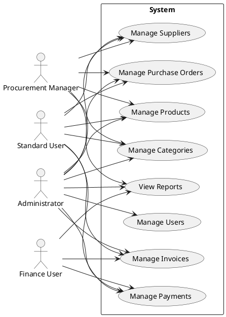
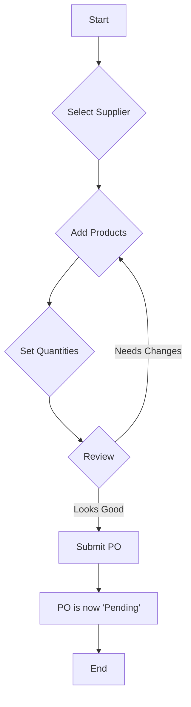
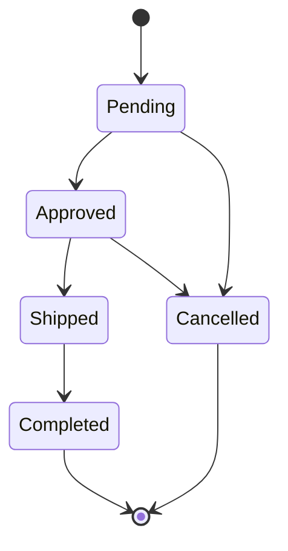

# Feature Overview (FRD)

This document shows what the system does from a user's point of view, covering all available features and functionalities.

### User Roles

The system implements role-based access control with the following roles:

| Role | Key Responsibilities |
|------|---------------------|
| **Administrator** | Full system access, including user management, supplier management, product management, purchase order management, invoice management, and payment processing. |
| **Procurement Manager** | Manages suppliers, products, categories, and purchase orders. Can view invoices and payments. |
| **Finance User** | Manages invoices and payments. Can view suppliers, products, and purchase orders. |
| **Standard User** | Read-only access to view suppliers, products, purchase orders, invoices, and payments. |

### Main Features (Use Cases)

### Core Modules

#### 1. Authentication & Authorization
- User login with JWT token-based authentication
- Role-based access control for all endpoints
- Password hashing with bcrypt

#### 2. User Management
- Create, read, update, and delete users
- Assign users to roles
- View all available roles

#### 3. Supplier Management
- Create, read, update, and delete suppliers
- Maintain supplier contact information
- Track supplier ratings

#### 4. Product Management
- Create, read, update, and delete products
- Maintain product descriptions and pricing
- Organize products into categories

#### 5. Category Management
- Create and read product categories
- Associate products with multiple categories

#### 6. Purchase Order Management
- Create purchase orders with multiple line items
- Track purchase order status through its lifecycle
- Associate purchase orders with suppliers and users

#### 7. Invoice Management
- Create invoices linked to purchase orders
- Track invoice status
- View invoice details

#### 8. Payment Processing
- Record payments against invoices
- Track payment amounts and dates
- View payment history

### Purchase Order Workflow

This is the main process for creating and managing a purchase order.

#### Activity Flow

#### PO Status Lifecycle
A purchase order moves through these states.

### Database Seeding
The system includes comprehensive database seeding functionality:
- Seed basic roles (Admin, Procurement Manager, Finance User, Standard User)
- Seed sample users with hashed passwords
- Seed sample suppliers with contact information
- Seed sample products with categories
- Seed sample purchase orders with line items
- Seed sample invoices and payments

This seeding functionality is useful for development, testing, and demonstration purposes.

### API Documentation
All system functionality is exposed through a RESTful API with comprehensive documentation.