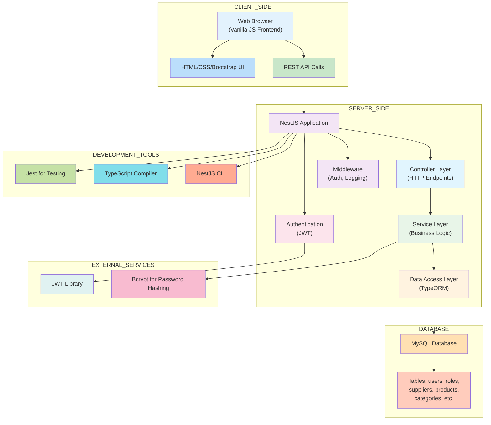
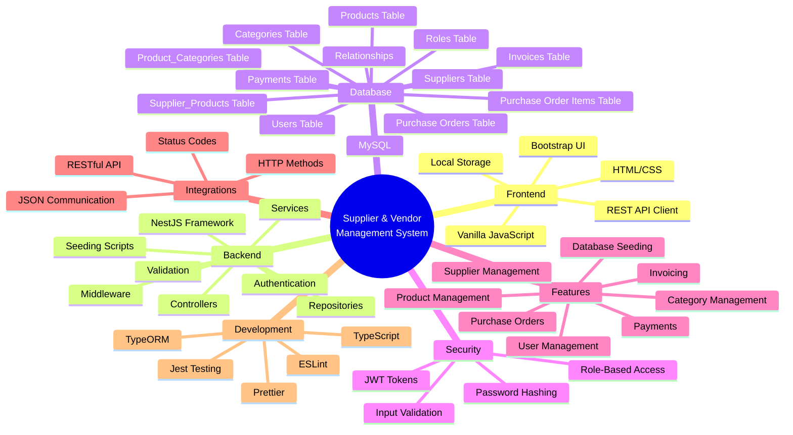
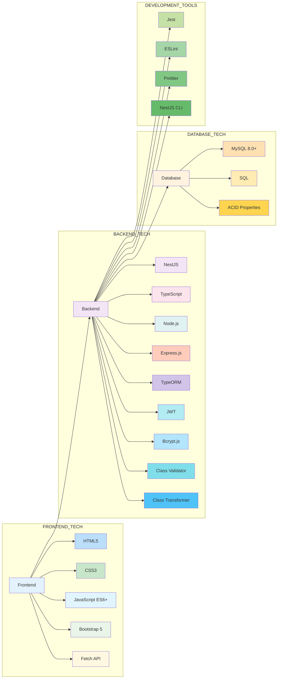

# System Overview

## Complete System Architecture

## System Components Breakdown

## Technology Stack

## Module Architecture

The system is organized into the following modules:

1. **Auth Module** - Handles authentication and JWT token generation
2. **Users Module** - Manages user accounts and roles
3. **Suppliers Module** - Manages supplier information
4. **Products Module** - Manages products and categories
5. **Purchase Orders Module** - Handles purchase order creation and management
6. **Invoices Module** - Manages invoice generation and tracking
7. **Payments Module** - Tracks payment records

Each module follows the NestJS modular architecture pattern with:
- Controllers (HTTP endpoints)
- Services (business logic)
- Entities (data models)
- DTOs (data transfer objects)
- Repositories (data access)

## Development & Testing

The system includes a comprehensive testing suite using Jest:
- Unit tests for services
- Mock repositories for isolated testing
- Test configuration files

Development tools include:
- ESLint for code quality
- Prettier for code formatting
- NestJS CLI for scaffolding
- TypeScript for type safety

## Seeding Scripts

The system provides multiple database seeding scripts:
- Basic seed for minimal data
- Full seed for comprehensive data
- Comprehensive seed for complete sample dataset

These scripts are useful for:
- Setting up development environments
- Testing functionality
- Demonstrating system capabilities

## API Structure

All API endpoints are prefixed with `/api/` and organized by module:
- `/api/auth` - Authentication endpoints
- `/api/users` - User management endpoints
- `/api/suppliers` - Supplier management endpoints
- `/api/products` - Product and category management endpoints
- `/api/purchase-orders` - Purchase order endpoints
- `/api/invoices` - Invoice endpoints
- `/api/payments` - Payment endpoints

## Security Features

- JWT-based authentication for all protected endpoints
- Bcrypt password hashing for secure storage
- Role-based access control
- Input validation using class-validator
- SQL injection prevention through TypeORM