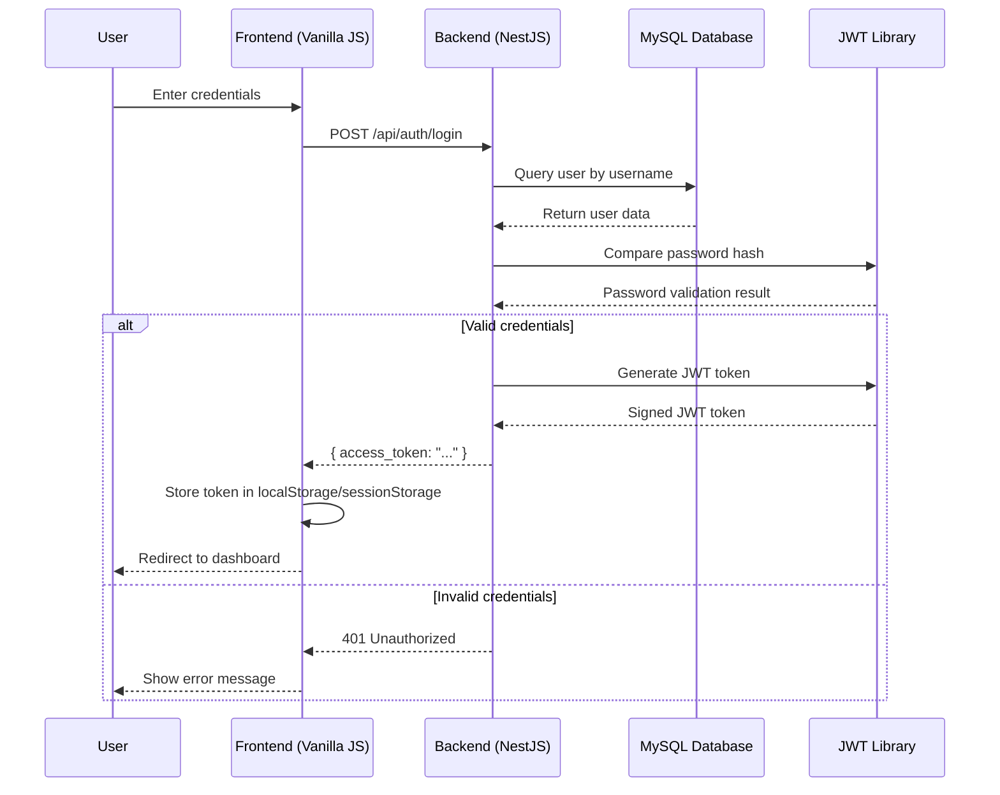
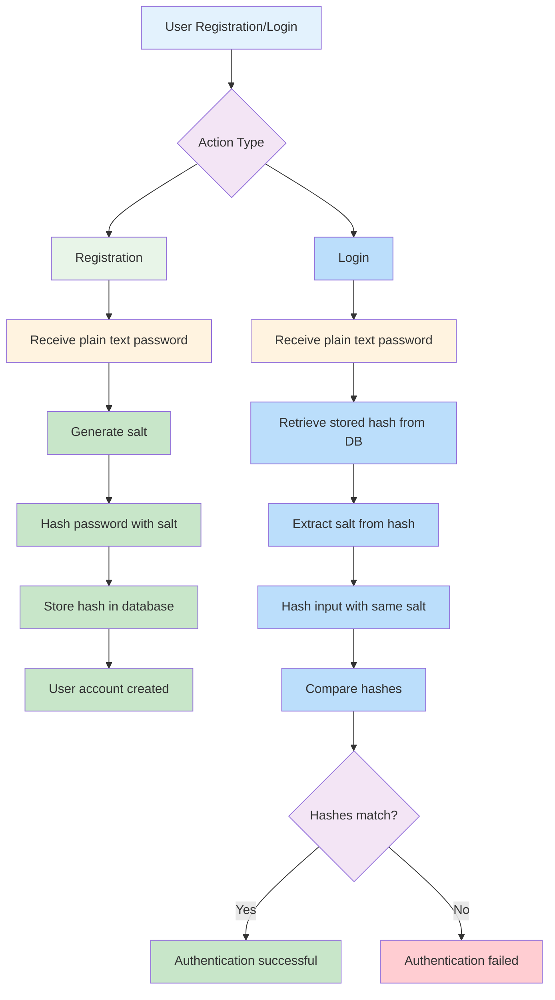
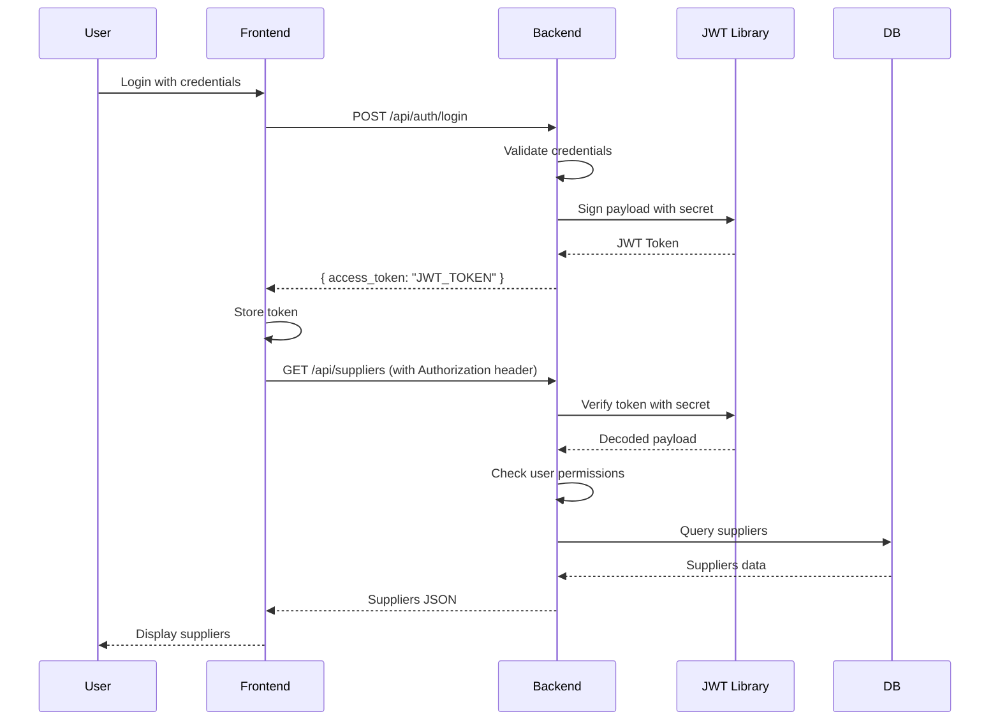
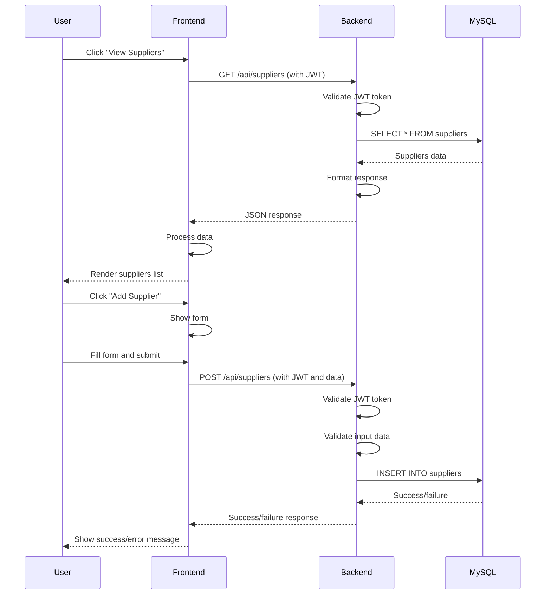
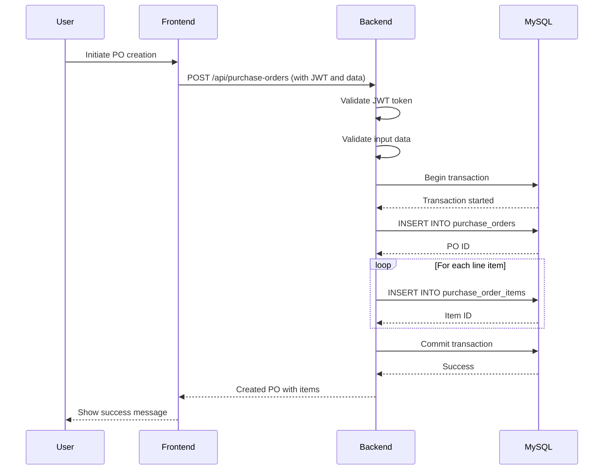
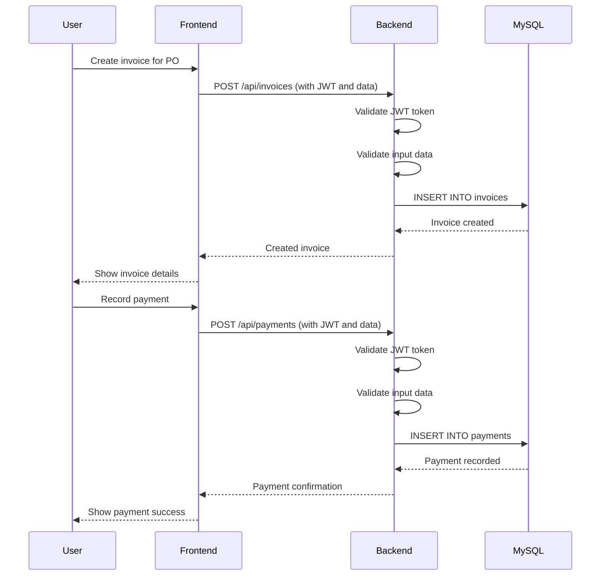
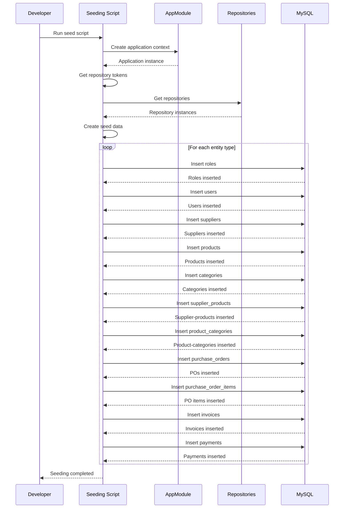
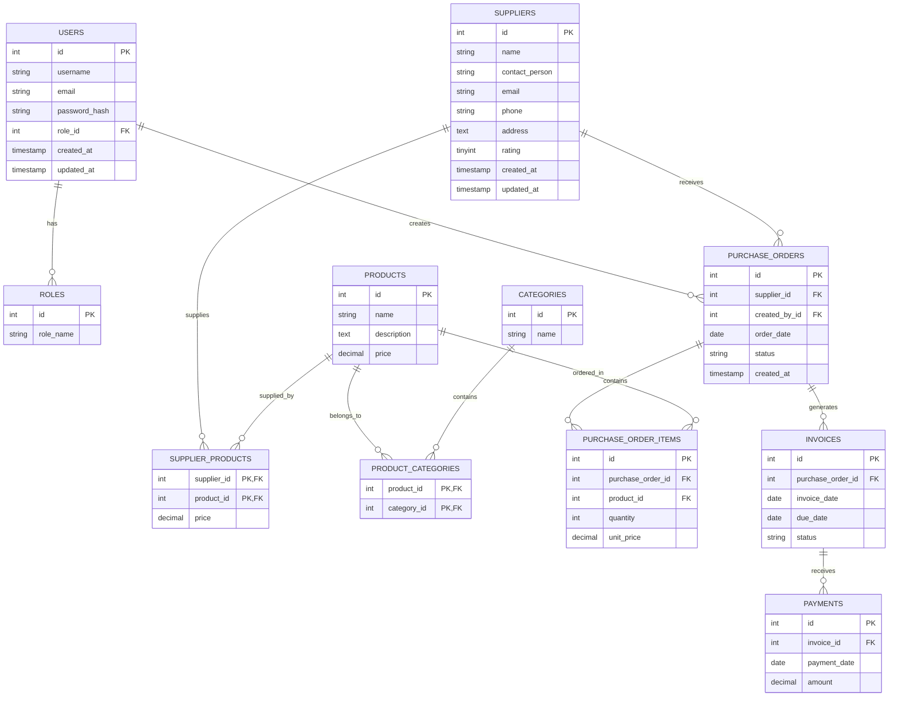
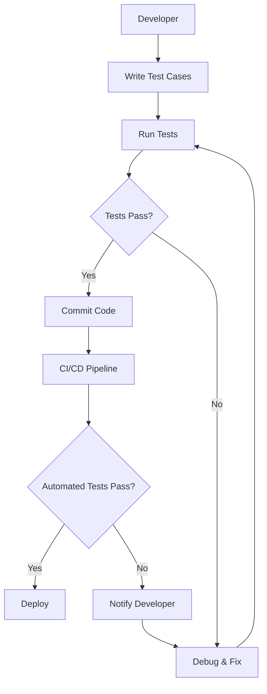

# Technical Workflows

## Authentication & Authorization Workflow

## Password Hashing Workflow

## JWT Token Workflow

## API Request/Response Workflow

## Purchase Order Creation Workflow

## Invoice & Payment Workflow

## Database Seeding Workflow

## Data Model Relationships

## Testing Workflow

